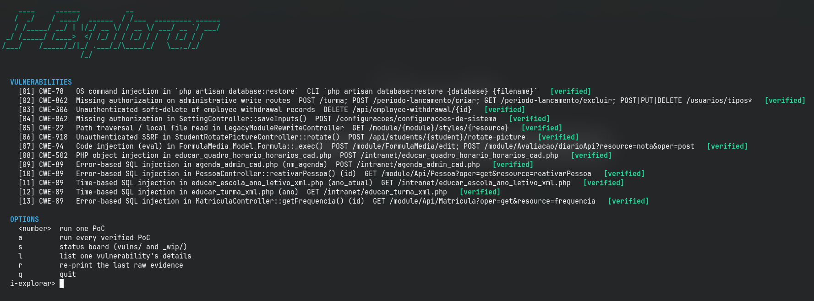

# i-explorar

Local-lab disclosure of vulnerabilities found in **i-Educar 2.11.0**
(portabilis/i-educar). Every PoC is stdlib Python 3 and only talks to the
local Docker lab (`127.0.0.1` / `localhost` / `::1`).

The single source of truth for each item is the `VULN` dict inside its own
`vulns/NN-<slug>/poc.py`. This file is generated by `python3 i-explorar.py --index`.



*The `i-explorar` orchestrator menu: 13 local-lab PoCs, one commit each, all `verified`.*

## Verified vulnerabilities

| ID | Title | CWE | Endpoint | Status | Advisory |
|----|-------|-----|----------|--------|----------|
| 01 | OS command injection in `php artisan database:restore` | CWE-78 | CLI `php artisan database:restore {database} {filename}` | `verified` | [vulns/01-db-restore-command-injection/README.md](vulns/01-db-restore-command-injection/README.md) |
| 02 | Missing authorization on administrative write routes | CWE-862 | `POST /turma; POST /periodo-lancamento/criar; GET /periodo-lancamento/excluir; POST\|PUT\|DELETE /usuarios/tipos*` | `verified` | [vulns/02-missing-authorization-admin-routes/README.md](vulns/02-missing-authorization-admin-routes/README.md) |
| 03 | Unauthenticated soft-delete of employee withdrawal records | CWE-306 | `DELETE /api/employee-withdrawal/{id}` | `verified` | [vulns/03-unauthenticated-employee-withdrawal-delete/README.md](vulns/03-unauthenticated-employee-withdrawal-delete/README.md) |
| 04 | Missing authorization in SettingController::saveInputs() | CWE-862 | `POST /configuracoes/configuracoes-de-sistema` | `verified` | [vulns/04-missing-authorization-settings-write/README.md](vulns/04-missing-authorization-settings-write/README.md) |
| 05 | Path traversal / local file read in LegacyModuleRewriteController | CWE-22 | `GET /module/{module}/styles/{resource}` | `verified` | [vulns/05-module-rewrite-path-traversal/README.md](vulns/05-module-rewrite-path-traversal/README.md) |
| 06 | Unauthenticated SSRF in StudentRotatePictureController::rotate() | CWE-918 | `POST /api/students/{student}/rotate-picture` | `verified` | [vulns/06-student-rotate-picture-ssrf/README.md](vulns/06-student-rotate-picture-ssrf/README.md) |
| 07 | Code injection (eval) in FormulaMedia_Model_Formula::_exec() | CWE-94 | `POST /module/FormulaMedia/edit; POST /module/Avaliacao/diarioApi?resource=nota&oper=post` | `verified` | [vulns/07-formula-media-eval-code-injection/README.md](vulns/07-formula-media-eval-code-injection/README.md) |
| 08 | PHP object injection in educar_quadro_horario_horarios_cad.php | CWE-502 | `POST /intranet/educar_quadro_horario_horarios_cad.php` | `verified` | [vulns/08-quadro-horario-object-injection/README.md](vulns/08-quadro-horario-object-injection/README.md) |
| 09 | Error-based SQL injection in agenda_admin_cad.php (nm_agenda) | CWE-89 | `POST /intranet/agenda_admin_cad.php` | `verified` | [vulns/09-agenda-sql-injection/README.md](vulns/09-agenda-sql-injection/README.md) |
| 10 | Error-based SQL injection in PessoaController::reativarPessoa() (id) | CWE-89 | `GET /module/Api/Pessoa?oper=get&resource=reativarPessoa` | `verified` | [vulns/10-pessoa-reativar-sql-injection/README.md](vulns/10-pessoa-reativar-sql-injection/README.md) |
| 11 | Time-based SQL injection in educar_escola_ano_letivo_xml.php (ano_atual) | CWE-89 | `GET /intranet/educar_escola_ano_letivo_xml.php` | `verified` | [vulns/11-escola-ano-letivo-sql-injection/README.md](vulns/11-escola-ano-letivo-sql-injection/README.md) |
| 12 | Time-based SQL injection in educar_turma_xml.php (ano) | CWE-89 | `GET /intranet/educar_turma_xml.php` | `verified` | [vulns/12-turma-xml-sql-injection/README.md](vulns/12-turma-xml-sql-injection/README.md) |
| 13 | Error-based SQL injection in MatriculaController::getFrequencia() (id) | CWE-89 | `GET /module/Api/Matricula?oper=get&resource=frequencia` | `verified` | [vulns/13-matricula-frequencia-sql-injection/README.md](vulns/13-matricula-frequencia-sql-injection/README.md) |

## Not verified

None.

## Usage

```bash
# interactive menu (ASCII banner)
python3 i-explorar.py

# run every verified PoC non-interactively
python3 i-explorar.py --all

# machine-readable summary
python3 i-explorar.py --all --json

# regenerate this file and RESEARCH-TIMELINE.md from the VULN dicts
python3 i-explorar.py --index

# any PoC runs standalone (ASCII banner + colored result)
python3 vulns/01-<slug>/poc.py --target http://127.0.0.1:8080

# add --print-evidence to also dump the full raw run log
python3 vulns/01-<slug>/poc.py --target http://127.0.0.1:8080 --print-evidence

# shortcut: run one PoC and print its newest raw evidence log
./tools/show-evidence.sh 01
```

## Lab

`lab/i-educar` is the upstream `2.11.0` release tag (latest release)
started with Docker Compose on `http://127.0.0.1:8080`. The checkout is
gitignored; PoCs can point at another checkout through `IEXPLORAR_LAB`.
