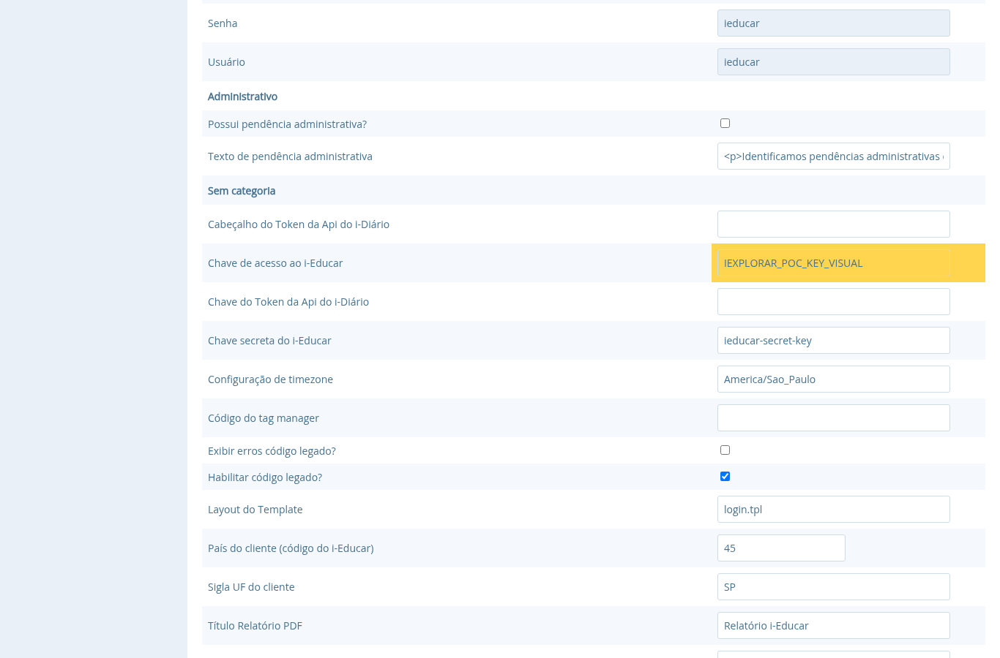
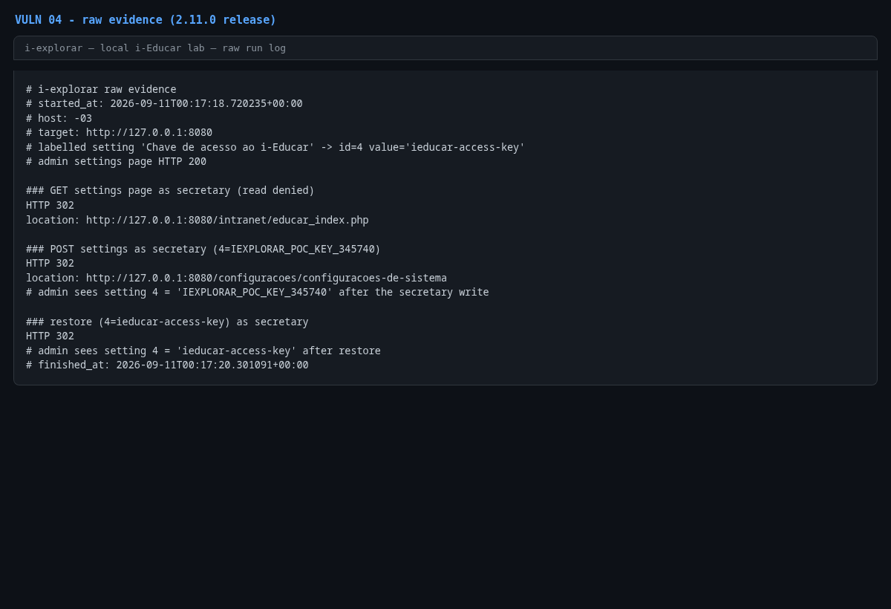

# Missing authorization in `SettingController::saveInputs()`

- **Product:** i-Educar 2.11.0 (latest release, tag `2.11.0`) (portabilis/i-educar)
- **Type / CWE:** CWE-862 Missing Authorization — https://cwe.mitre.org/data/definitions/862.html
- **Severity:** `CVSS:3.1/AV:N/AC:L/PR:L/UI:N/S:U/C:N/I:H/A:H` = **8.1 High** (estimated from the vector, not an upstream score)
- **Affected version:** 2.11.0 (latest release, tag `2.11.0`)
- **Endpoint(s):** `POST /configuracoes/configuracoes-de-sistema` — parameter(s): any `<setting id>=<value>`, e.g. `3=IEXPLORAR_POC_KEY` (`legacy.apis.access_key`)
- **Authentication:** login required, any profile (verified with the non-admin `secretary` profile, user type level 2)
- **Status:** VERIFIED against a local i-Educar 2.11.0 lab (2026-09-10)

## Summary

`SettingController::index()` correctly refuses non-admins, but
`saveInputs()` — the action that writes every submitted key/value pair into
the `settings` table — has no authorization check, and the route
`POST /configuracoes/configuracoes-de-sistema` has no `can:` middleware. Any
authenticated user can modify system-wide settings. The PoC changes
`legacy.apis.access_key` (setting id 3), which is the shared key used by the
legacy API and by integrations, but the same form can rewrite database,
mail, timezone and feature settings.

## Root cause

`app/Http/Controllers/SettingController.php:25` (read action, protected):

```php
if (!$request->user()->isAdmin()) {
    return back()->withErrors(['Error' => ['Você não tem permissão para acessar este recurso']]);
}
```

`app/Http/Controllers/SettingController.php:36` (write action, unprotected):

```php
public function saveInputs(Request $request)
{
    foreach ($request->all() as $key => $value) {
        Setting::where('id', $key)->update(['value' => $value]);
    }

    SystemSettingsUpdatedEvent::dispatch();

    return redirect()->route('settings.index')->with('success', 'Configurações de sistema salvas com sucesso.');
}
```

`routes/web.php:192-193` registers both actions in the global `auth` group
without any `can:` middleware:

```php
Route::get('/configuracoes/configuracoes-de-sistema', 'SettingController@index')->name('settings.index');
Route::post('/configuracoes/configuracoes-de-sistema', 'SettingController@saveInputs')->name('settings.update');
```

The submitted key is used directly as `settings.id`; the input names rendered
by `resources/views/settings/string-input.blade.php` are the setting ids.

Note: the original report for this issue referenced setting id 4 as
`legacy.apis.access_key`; in this tree id 4 is `legacy.apis.secret_key` and
id 3 is `legacy.apis.access_key`. The PoC uses the real mapping (id 3).

## Proof of concept

1. Log in as the non-admin `secretary`.
2. Confirm the read is denied: `GET /configuracoes/configuracoes-de-sistema`
   redirects instead of rendering.
3. Write a new value with
   `POST /configuracoes/configuracoes-de-sistema` (`3=IEXPLORAR_POC_KEY_<pid>`);
   the server answers `302` to the settings page.
4. Log in as admin and load the settings page: the "Chave de acesso ao
   i-Educar" field shows the attacker value.
5. Restore the original value through the same endpoint.

```bash
python3 i-explorar.py            # pick [04]
# or standalone:
python3 vulns/04-missing-authorization-settings-write/poc.py --target http://127.0.0.1:8080
```

## Evidence

Raw output of the PoC run against the 2.11.0 release (`evidence/run-20260911T001718Z.log`), pasted
verbatim:

```
# i-explorar raw evidence
# started_at: 2026-09-11T00:17:18.720235+00:00
# host: -03
# target: http://127.0.0.1:8080
# labelled setting 'Chave de acesso ao i-Educar' -> id=4 value='ieducar-access-key'
# admin settings page HTTP 200

### GET settings page as secretary (read denied)
HTTP 302
location: http://127.0.0.1:8080/intranet/educar_index.php

### POST settings as secretary (4=IEXPLORAR_POC_KEY_345740)
HTTP 302
location: http://127.0.0.1:8080/configuracoes/configuracoes-de-sistema
# admin sees setting 4 = 'IEXPLORAR_POC_KEY_345740' after the secretary write

### restore (4=ieducar-access-key) as secretary
HTTP 302
# admin sees setting 4 = 'ieducar-access-key' after restore
# finished_at: 2026-09-11T00:17:20.301091+00:00
```

## Screenshots



Caption: admin settings page after the non-admin secretary's `POST`, with
"Chave de acesso ao i-Educar" (`legacy.apis.access_key`) set to the attacker
value `IEXPLORAR_POC_KEY_VISUAL`. The value was restored after the capture.



Caption: console capture of the PoC run against the 2.11.0 lab.

## Impact

Any authenticated low-privilege user can:

- rotate `legacy.apis.access_key`/`secret_key`, locking out legitimate
  integrations or enabling unauthorized legacy API usage;
- change database connection settings (`legacy.app.database.*`), mail and
  timezone configuration, or feature flags such as error display
  (`legacy.display_errors`), which can expose debugging information;
- corrupt system-wide configuration and trigger side effects emitted by
  `SystemSettingsUpdatedEvent`.

Combining this write primitive with any other authenticated issue (for
example the SQL injection in `MatriculaController::getFrequencia()`, VULN 13
of this repository) increases the reachable impact.

## Timeline

- 2026-09-10: local reproduction against the i-explorar 2.11.0 lab (this advisory)
- not yet reported to the maintainer — no remote or external contact was made
  from this repository

## Mitigation

- Add the same `isAdmin()` check used by `index()` at the top of
  `saveInputs()`, or protect the route with a dedicated policy/`can:`
  middleware.
- Restrict the accepted keys to an explicit allowlist instead of
  `$request->all()` and validate the value type per setting.
- Log setting changes with the acting user id for auditability (the settings
  table itself does not record who changed a value).

## References

- Upstream repository: https://github.com/portabilis/i-educar
- CWE-862: https://cwe.mitre.org/data/definitions/862.html
- This advisory (canonical URL): https://github.com/pollotherunner/i-explorar/blob/main/vulns/04-missing-authorization-settings-write/README.md
